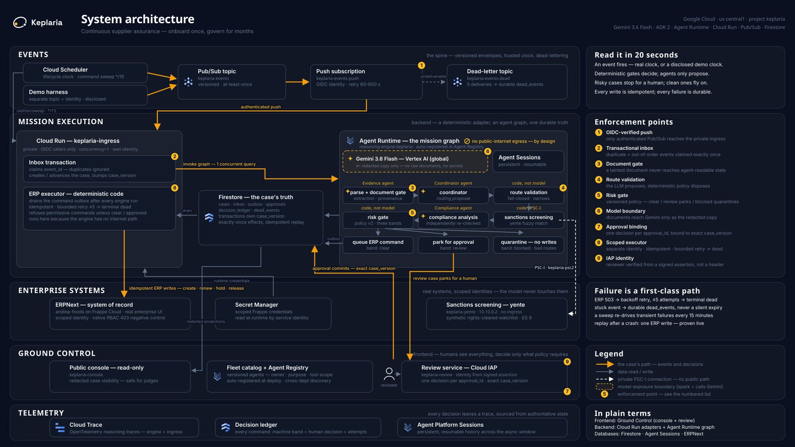

# Keplaria

Agent project built on the [Google Agent Development Kit (ADK)](https://adk.dev)
for Python, targeting the
[Gemini Enterprise Agent Platform](https://docs.cloud.google.com/gemini-enterprise-agent-platform/models/start).

**Continuous supplier assurance.** A supplier is onboarded once and then kept
compliant with no one watching. The same durable mission that created the ERP
record wakes months later on its own clock, requests renewed evidence, places a
reversible hold when the certificate lapses, validates the renewal against the
source document, and releases the hold. Work that a person otherwise does by hand,
on a calendar reminder, if they remember.

One deployed run of that whole loop: **61.5 s of machine time and a single
25.5 s human approval**, against an author-timed manual walkthrough of the work
that took **663.5 s over 20 steps** — 19 of which the run removes, the twentieth
being the approval that policy requires a human to make. Numbers and method:
[`spikes/judge_run/evidence.json`](spikes/judge_run/evidence.json) and
[`spikes/manual_baseline/evidence.json`](spikes/manual_baseline/evidence.json).
The baseline is author-timed, not practitioner-reviewed, and is labelled that
way everywhere it is used.

Live case console (no sign-in):
<https://keplaria-console-bklu5jcdea-uc.a.run.app>

## Judging criteria → proof

Every row points at a file in this repository that was produced by running the
system, not by describing it. `spikes/core_contracts/harness.py` re-executes the
tests it cites and re-reads the evidence it cites on every run, so a claim here
cannot outlive the behaviour behind it.

| Criterion | What it asks | Proof in this repo |
|---|---|---|
| **Innovation & Operational Utility** (40%) | Does it remove real friction, decide autonomously, and complete high-value work rather than chat? Is the task complex enough to warrant multiple agents, and does it delegate intelligently? | The lifecycle closes: onboard → wake → request evidence → hold → validate renewal → release, over two suppliers and 380 simulated business days, in [`spikes/judge_run/`](spikes/judge_run/). A coordinator selects the Evidence and/or Compliance agent from the event and the case's own state; two case variants take different routes. Friction is measured against the manual baseline above, not asserted. |
| **Architectural Discipline & Tech Stack** (30%) | Are systems decoupled and maintainable, state durable, tools isolated, credentials scoped, failures handled? How does routing recover from a looping or hallucinating worker? | Nine contracts in [`spikes/core_contracts/evidence.json`](spikes/core_contracts/evidence.json): closed loop, duplicate and out-of-order events, provenance failure, injection refusal, stale and double approval, forbidden agent→tool edges, one ERP write after a retry, cataloging visible, and the eval suite. A schema-valid but source-unsupported worker value is rejected, retried within bounds, and quarantined for a human instead of reaching the ERP. |
| **Demo & Production Readiness** (30%) | Does the video define the friction and architecture, show an unedited live execution, and are setup, diagram, deployment and proof reproducible? | The console URL above is live. The run in `spikes/judge_run/` is a real deployment, re-run on the engine currently serving. `bash scripts/doctor.sh` checks deployment and configuration preconditions read-only and prints its own pass/fail summary; the architecture diagram is generated from committed sources, not drawn; setup is [below](#setup-from-a-fresh-clone). |

## Platform subsystem coverage

The track names seven subsystems. This table says which are used natively, which
are answered by a first-party equivalent, and which are deliberately not used.
A subsystem that is not used says so and says why — including the one that was
measured and turned down.

| Subsystem | Status | What is actually true |
|---|---|---|
| **Agent Runtime** | Native | Hosts the ADK graph as reasoning engine `keplaria`. Reaches the screening VM over a PSC interface; that VM has no external IP and is not reachable from the internet, and keeps execution state in Agent Platform Sessions. |
| **Agent Registry** | Native | The deployment auto-registers with no publish step; the entry is live and refreshes on redeploy. It carries the framework (`google-adk`), the runtime reference, the runtime identity principal, and the callable interfaces. Honest limit: those are the fields the Registry populates itself — it holds no owner, purpose, or tool-scope description of its own. |
| **Agent Identity** | First-party equivalent | Each service runs as its own service account; secrets come from Secret Manager. The ERP identity is scoped rather than trusted: it receives Frappe's native 403 on anything outside its role. The reviewer's identity is verified from a signed IAP assertion, never from a header a caller could set. |
| **Memory Bank** | Deliberately not used | Transactional Firestore owns authoritative case state — case version, event claim, approval, command outbox — and Sessions retain resumable agent history. Generative memory is not trusted with compliance facts, and Sessions are not described here as a Memory Bank equivalent; they hold different things. |
| **Model Armor** | Measured, not adopted | Probed against this project's own corpus on 2026-08-19 and turned down on the evidence: its prompt-injection filter returns `NO_MATCH_FOUND` on the planted injection fixture that the incumbent check catches with five findings, and its data plane is unreachable from the engine's network. One filter did deliver — malicious-URI detection, with no false positives on clean fixtures. Full measurement, including the context-dilution boundary that explains the miss: [`spikes/model_armor/evidence.json`](spikes/model_armor/evidence.json). |
| **Agent Gateway** | Not used | Ingress is an authenticated Pub/Sub push adapter on Cloud Run that refuses anonymous callers, and the human decision surface sits behind IAP. Nothing in the design needed a gateway in front of that. |
| **Agent Observability** | Native | Cloud Trace and Cloud Logging. Traces are load-bearing rather than decorative: a 10.6 s rise in run time was diagnosed node-by-node against them and traced to model reasoning length, not to code. |

## Architecture



The diagram is generated, not drawn: `uv run python docs/architecture/build.py`
rebuilds `docs/architecture/architecture.svg` from the committed sources under
`docs/architecture/assets/` (a PNG export for form uploads sits alongside it).
Update the build script whenever a component is added or moved — the diagram
is part of the submission and must match the deployed system.

The agent graph and its adapters run on two different runtimes:

- **Agent Runtime** hosts the ADK graph — reasoning engine `keplaria`
  (`projects/584548214478/locations/us-central1/reasoningEngines/2127503872455868416`).
  It reaches the private yente screening VM over the `keplaria-psc2` PSC-I
  network attachment and keeps agent execution state in Agent Platform
  Sessions.
- **Cloud Run** hosts `keplaria-ingress`, the authenticated Pub/Sub push
  adapter and the component that talks to both Firestore and the ERP, plus
  two more services covering the human side of a parked case:
  `keplaria-console` (public, read-only case visibility) and
  `keplaria-review` (the authenticated decision surface). See
  [Case console and review service](#case-console-and-review-service).
  `keplaria-ingress` is the only one of the three that can push a state
  change through the graph; the other two only read and decide on state the
  graph already produced.

Everything is in `us-central1`.

### Event flow

```text
topic keplaria-events
  -> OIDC-authenticated push subscription keplaria-events-push
  -> private Cloud Run ingress (keplaria-ingress)
  -> Firestore inbox transaction (claims event_id, creates/advances the
     case, bumps case_version)
  -> Agent Runtime graph: parse -> LLM coordinator routing proposal ->
     deterministic route validation (app/policy.py) -> yente screening
     over PSC-I -> (when candidates exist) compliance interpretation,
     independently checked -> deterministic risk gate (app/risk.py) ->
     queue ERP command, or park/quarantine the case
  -> ingress drains the command outbox and performs the ERP write
```

**The ERP executor runs in the ingress, not in the graph.** The
PSC-attached engine has no public internet egress — Cloud NAT is
`ENDPOINT_TYPE_VM`, which does not cover a PSC interface NIC — so the engine
itself cannot reach Frappe Cloud. The deterministic executor that performs
ERP writes therefore lives in the ingress process. This is a genuinely
separate component from the agent graph, by design, not a workaround.

**Two deterministic gates, both fail-closed.** The LLM coordinator only
proposes a route; `app/policy.py` decides whether it is permitted, and a
refused proposal routes to a `quarantine_case` terminal that performs no
command claim and no ERP write. Screening results then pass through a second,
independent gate: `app/risk.py` scores the case against a versioned policy
fixture (`policy/supplier_risk.v2.json`) and returns one of three bands.
`clear` queues the ERP command; `review` parks the case as
`awaiting_approval`; `blocked` quarantines it. A supplier yente flags as a
match scores at or above the block threshold and never reaches the command
queue. `app/executor/runner.py`, run from the ingress, re-reads that
persisted verdict before draining any command and refuses to drain one whose
case is not `clear` — at a different identity boundary, since the Cloud Run
ingress runs under a different identity than the Agent Runtime graph.

For a `blocked` case that refusal is a backstop rather than a second
independent check: `quarantine_case` claims nothing, so there is nothing to
refuse, and the graph's `assess_risk` branch is what actually stops a flagged
supplier. For a `review` case it is the primary enforcement — see below.

**Human approval.** A parked case claims the commands it would run and
executes none of them, so a reviewer can see what they are approving rather
than only that something is waiting. Those commands drain to
`refused_by_policy` on every pass until a decision arrives.
`app/state/approvals.py` commits that decision in a single Firestore
transaction, keyed by an `approval_id` and taken against a specific
`case_version`. A replayed `approval_id` is rejected as a duplicate; a
decision taken against a version the case has since passed is rejected as
stale; and an approval stops applying the moment a later event advances the
case version, so it can never authorise a write for state the reviewer never
saw.

The deterministic gate's verdict is never overwritten. The executor combines
the machine's band with the human's decision and records both, so the outbox
shows whether policy or a person decided, and a rejection can withhold what
the gate would have granted.

Restrictive actions — a hold — bypass this entirely, and the consequence is
sharper than "bypass" suggests: **a hold never waits for a human at all.** The
executor refuses only permissive commands and the ingress drains the outbox
after every engine invocation, so a claimed `apply_hold` executes on that
drain while the case is still parking — already applied in the ERP before a
reviewer opens the page. Refusing to hold a risky supplier because a case is
under review would invert the gate's purpose, so the guard is deliberately
one-directional: it can stop this process granting something, never stop it
withholding something.

Both directions are proven on the deployed system, by a reviewer signed in
through IAP:

- **Approval releases** — `spikes/hitl_release/evidence.json`. A case parked
  on a genuine near-match (0.672, `match=false`) was approved and
  `create_supplier` wrote to the live ERP.
- **Rejection withholds** — `spikes/hitl_reject/evidence.json`, track A.
  `create_supplier` stayed `pending` and no Supplier was ever created.
- **Rejection does not withhold a restriction** — same evidence, track B. The
  ERP hold was written 11m08s *before* the decision committed, both Firestore
  server timestamps, while the three permissive commands beside it stayed
  refused after the rejection.

Track B also shows that a parked case still advances: its lifecycle walked
`active → renewal_requested → held` with every permissive command refused
throughout, because `park_case` persists lifecycle state and only *execution*
is gated.

Honest limits. The `review` band is a parked case, not a live pause —
`RequestInput` is not in this graph, and a later milestone reinstates a real
pause on this same branch. `apply_hold` is the only member of
`app.lifecycle.RESTRICTIVE`, so the restrictive claim is about one action, not
a category. And a `blocked` case claims nothing at all, so a supplier who
becomes sanctioned after onboarding still cannot be held — closing that means
letting the quarantine terminal claim restrictive commands, which is a
separate decision.

**Document injection gate.** `app/injection.py` scans a document's redacted
text for a sentence that pairs a machine-directed instruction (imperative
phrasing aimed at the reader-as-agent) with a machine-reader signal, before
any agent sees that text. This is a **heuristic over a representative
fixture, not a general prompt-injection defence** — it does not claim to
catch every phrasing of an injected instruction, only the pattern the fixture
exercises. What it does guarantee is exact: `load_case_state` marks a
document carrying that pattern `document_tainted` and blanks its text out of
the state keys an agent instruction can resolve, so a tainted document is
never shown to a model. `apply_route` still routes the case to screening
when the event type permits compliance — the entity gets checked in that
case — but skips extraction entirely, so no agent ever reads the tainted
text or acts on an instruction inside it.
`DOCUMENT_INJECTION` is a scored factor in the risk policy and the gate in
`app/nodes.py`'s `assess_risk` additionally forces the verdict to `blocked`
on both the fresh-scoring and carry-forward paths whenever the flag is set,
regardless of what the rest of the score says. The combination — no
agent-visible text, no extraction, and a gate that cannot clear a tainted
event — means **a tainted document cannot produce an ERP write**.

Grounding is a separate control and is **not** what stops this: `app/grounding.py`
checks that an extracted field's span traces back to the source document, and
by design it will accept an extraction that faithfully quotes an injected
instruction — grounding certifies faithfulness to the text, not the
trustworthiness of the text's author. `tests/unit/test_grounding.py::test_grounding_accepts_an_injection_obedient_extraction`
pins exactly this as a regression, not an endorsement: the control that stops
an injected value from reaching the ERP is the injection gate described
above, not grounding.

**Idempotency.** Every side effect is a Firestore command with a
deterministic ID (`{case_id}:{action}`). A command already `DONE` is never
re-driven, so a replayed event produces exactly one ERP write. ERP records
are keyed by supplier name, so a duplicate create collides natively (409)
and is reported rather than retried blindly.

### Operational constraints

- **Agent Runtime allows 1 concurrent query and 30 queries/min per
  region.** `keplaria-ingress` is deployed with `--concurrency=1
  --max-instances=1`, and the `keplaria-events-push` subscription carries an
  explicit retry policy (`60s`–`600s` backoff). Without both, a single
  rate-limit error becomes a self-sustaining redelivery storm: the ingress
  503s, Pub/Sub redelivers near-instantly, the engine takes another hit,
  guaranteed 429, repeat.
- **A `thinking_budget` on the agents is an off switch, not a dial.** The three
  agents in `app/agent.py` pin one. Naming any value does not truncate the
  model's usual reasoning at that number: the value comes back in the trace as
  `gen_ai.usage.experimental.reasoning_tokens_limit`, a ceiling the model then
  leaves nearly empty. Measured 2026-08-18 on the deployed engine, the extractor
  went from ~1500 reasoning tokens per call to effectively none and the timed
  sequence from 85.4s to 56.9s. Read the numbers as "reasoning off"; raising one
  will not buy a middle setting. Validated by 8/8 graded domain cases and a full
  deployed run, and pinned by `tests/unit/test_agent_generation_config.py`.
- **A yente VM that is RUNNING is not yet SERVING, and the difference costs
  30s per screened beat.** `screen_supplier` waits `timeout=30` before giving
  up and recording `SCREENING_UNAVAILABLE`, so a sequence started while the
  index is still loading pays that on every screened event. `scripts/doctor.sh`
  probes the service over IAP rather than trusting the VM's run state; run it
  after starting the VM and before any timed or recorded run.
- **`GOOGLE_CLOUD_LOCATION` must be `global`, not `us-central1`** —
  `gemini-3.6-flash` 404s at the regional endpoint. This is documented, not
  incidental: the [official model card](https://docs.cloud.google.com/gemini-enterprise-agent-platform/models/gemini/3-6-flash)
  lists only `global` and the `us`/`eu` multi-regions as supported — no single
  regions — so there is no regional endpoint to migrate to. `AGENT_ENGINE_LOCATION`
  is a deliberately separate variable (`us-central1`) that addresses only
  the Agent Engine REST endpoint. These two are kept apart on purpose:
  collapsing them into one variable is the obvious "simplification" that
  breaks the deployment, because the model-serving endpoint and the Agent
  Engine endpoint are different hosts.
- **`GOOGLE_CLOUD_PROJECT` is platform-reserved on Agent Runtime** and is
  overwritten with the numeric project number, which the Firestore client
  rejects. `FIRESTORE_PROJECT_ID` carries the project ID for the Firestore
  client instead.
- **Frappe credentials reach the ingress from Secret Manager**, not as
  plaintext environment variables.

### Verification

- `scripts/doctor.sh` — 56 read-only checks (one fewer when the yente VM is
  stopped, since the serving probe only runs against a running VM) covering
  toolchain, auth,
  provisioned infra, the event-flow wiring (topic, push subscription
  OIDC, ingress auth, concurrency/maxScale, retry policy), the console and
  review services, and the failure-handling infrastructure (dead-letter
  topic, `maxDeliveryAttempts`, both Pub/Sub service-agent bindings, the
  sweep schedule, and the `outbox` collection-group index in both Firestore
  databases) — see
  [Case console and review service](#case-console-and-review-service) and
  [Failure handling](#failure-handling).
- `spikes/core_contracts/harness.py` — the one artifact that answers "is
  everything this system claims still proven?". It does not re-run the closed
  loop; it re-executes the pytest node ids and re-reads the spike evidence
  that back each contract (duplicate and out-of-order events, provenance
  failure, injection refusal, stale and double approval, forbidden
  agent→tool edges, one ERP write after retry, cataloging, the graded eval
  suite), plus two read-only live checks — one against deployed Firestore and
  the ERP, one against Agent Registry. **Deliberately self-checking rather
  than a hand-maintained list:** a test that is deleted, renamed, or red
  demotes its criterion instead of continuing to look green. Exits non-zero if
  any contract is unproven, and writes
  `spikes/core_contracts/evidence.json`. Needs `--env-file .env` for the live
  checks.

  Both live checks **discover** what they verify rather than naming it. The
  retry check asks the deployed ledger whether any command carries
  `status: done` with `execution_attempts >= 1` (`record_failure` is that
  field's only writer, so that combination *is* a failure followed by a
  success); the cataloging check queries Agent Registry for an entry naming a
  reasoning engine, carrying the expected display name, and pointing at the
  engine the runtime spike recorded. Neither is a hardcoded id, because both
  were: a routine ERP cleanup deleted the records the retry check named and
  took the criterion with them, and the cataloging claim rested on a note in
  the manifest rather than on anything a re-read could check.
- `spikes/core_contracts/redrill_retry.py` — re-makes the retry proof when
  the ledger holds none. Some criteria assert things about *deployed state*,
  so their evidence is a pair of live records rather than a committed file,
  and live records get deleted. The failure it produces is real (a
  `clear_hold` against a supplier absent from the ERP, refused with a 404),
  the repair is real, and the **deployed sweep** — not the script — finds the
  failed command and drives it to `done`. Aborts if the supplier already
  exists, since the first drain would then succeed and leave
  `execution_attempts` at 0 while every step reported green. Writes
  `spikes/core_contracts/retry_drill.json`; `scripts/erp.py purge` refuses to
  delete anything that file names.
- `spikes/dlq/harness.py` — proves bounded retry and durable dead-lettering
  against deployed resources: a command driven to `dead` through five real
  ERP refusals and not re-driven a sixth time, the deployed `POST /admin/sweep`
  finding and driving a stuck case, and an event actually landing in
  `dead_events`. Writes `spikes/dlq/evidence.json`.
- `spikes/lifecycle/harness.py` — drives the full five-step station-keeping
  lifecycle (onboarding, early renewal check, renewal request, overdue hold,
  renewed evidence and hold release) against the deployed engine and ingress,
  and writes `spikes/lifecycle/evidence.json`. This is the current
  post-deploy verification script — see
  [Deploying](#deploying-to-agent-runtime). The committed evidence is one
  five-step deployed lifecycle run with all five steps passing.
- `spikes/hitl_reject/harness.py` — the rejection half of the approval
  contract, in three modes (`park`, `verify`, `teardown`) because the decision
  itself is a human in a browser and cannot be automated. Parks two review-band
  cases: one whose supplier is absent from the ERP, so "the rejection created
  nothing" is checkable, and one walked through to an overdue hold. Asserts
  that the hold's completion timestamp *precedes* the approval's, which is what
  makes "a restriction never waits for a human" a measurement rather than a
  reading of the code. `teardown` releases the ERP hold and is deliberately
  separate, so the evidence is captured against a genuinely held record.
  Writes `spikes/hitl_reject/evidence.json`.
- `spikes/hitl_release/harness.py` — the approval half, same two-phase shape.
  Writes `spikes/hitl_release/evidence.json`.
- `spikes/thin_vertical/verify.py` — the narrower single-event vertical
  (event → route → screen → ERP write), superseded by the lifecycle harness
  as the post-deploy check but still runnable.

## Setup from a fresh clone

Requires [uv](https://docs.astral.sh/uv/) and the `gcloud` CLI. uv provisions its
own Python — no system interpreter, pyenv, or Homebrew Python is involved.

```bash
uv sync                                       # creates .venv from uv.lock
gcloud auth application-default login         # once per machine
cp .env.example .env                          # then edit if needed
uv run adk web                                # ADK dev UI
```

## Environment

| | |
|---|---|
| Python | **3.13.13**, uv-managed (pinned in `.python-version`) |
| Package manager | **uv** |
| Venv | `.venv/` — self-contained, links to no system interpreter |
| ADK | `google-adk` 2.5.0 |
| Reference dev host | NVIDIA DGX Spark — Ubuntu 24.04, **aarch64** |
| Domain | **keplaria.com** — registered via Cloudflare Registrar (2026-08-11) |
| Cloudflare CLI | `wrangler` (nvm-managed Node), OAuth-authenticated |

The keplaria.com zone is live on Cloudflare nameservers; no DNS records point
anywhere yet. `wrangler` is logged in as the personal account (the same
identity as gcloud and git in this repo), with
write scopes for Workers, Pages, DNS routes, D1, KV, queues, email routing, and
SSL certs, so it can deploy and wire up DNS without re-authenticating. Brand
assets for the site live in the sibling repo `~/dev/git/keplaria-assets`.

## Dependency management: use `uv`, never `pip`

**Do not run `pip install` in this project, and never use
`--break-system-packages`.**

On the reference dev host both interpreters on `PATH` are PEP 668
externally-managed and will correctly reject a global install:

- Linuxbrew Python 3.14.6 (first on `PATH`) — has `EXTERNALLY-MANAGED`
- `/usr/lib/python3.12` — has `EXTERNALLY-MANAGED`

`pyenv` is installed there but set to `system` with an empty `~/.pyenv/versions`,
so its shims fall straight through to the Linuxbrew Python. pyenv is **not** the
source of install failures, and switching pyenv versions is not the fix. The
`EXTERNALLY-MANAGED` marker is what protects the host's system Python — work
inside `.venv`, don't override it.

### Commands

```bash
uv add <package>          # add a dependency (updates pyproject.toml + uv.lock)
uv remove <package>       # drop a dependency
uv sync                   # reconcile .venv with uv.lock
uv run python ...         # run inside the venv
uv run adk web            # ADK dev UI
```

`uv run` needs no activation. `source .venv/bin/activate` also works — the venv's
`bin/` prepends `PATH`, so pyenv shims don't interfere.

Reset is `rm -rf .venv && uv sync`.

### Installing or upgrading ADK

ADK publishes per-version constraints files pinning transitive deps to a
known-good set on a few days' delay, as supply-chain protection against a
freshly-published malicious dependency. Use them for any ADK install or major
upgrade:

```bash
curl -sSfLO https://raw.githubusercontent.com/google/adk-python/main/constraints-3.13.txt
uv add google-adk --constraints constraints-3.13.txt
rm constraints-3.13.txt
```

Files exist for `constraints-3.10.txt` through `constraints-3.14.txt`. `uv.lock`
records the resolved result, so the constraints file is not kept in the repo.

### Why Python 3.13 and not 3.14

ADK requires `>=3.10` and is tested through 3.14, but on aarch64 several
transitive dependencies still lack 3.14 wheels and fall back to source builds.
Stay on 3.13 unless there is a concrete reason to move.

## Google Cloud

| | |
|---|---|
| Project ID | `keplaria` (project number `584548214478`) |
| Region | `us-central1` |
| APIs enabled | Agent Platform (`aiplatform`), **Agent Registry (`agentregistry`)**, **Cloud Resource Manager**, Run, Compute, Firestore, Pub/Sub, Secret Manager, Cloud Scheduler, BigQuery, Cloud Trace, IAP, Model Armor, Cloud Build, Artifact Registry, Cloud Functions, Eventarc, Cloud Billing (+Budgets) |

`cloudresourcemanager.googleapis.com` is not optional: the GCP OpenTelemetry
resource detector and the Cloud Logging client both call it, and it was disabled
until 2026-08-13.

Authentication is via Application Default Credentials. Verify with:

```bash
gcloud config list                                  # expect project = keplaria
gcloud auth application-default print-access-token  # expect a token
```

`aiplatform.googleapis.com` is now surfaced as the **Agent Platform API** — the
Vertex AI API under its current name, not a separate product.

### Provisioned infrastructure

- **Network:** `keplaria-vpc` (custom mode), subnet `keplaria-uscentral1`
  `10.10.0.0/24` with Private Google Access, Cloud NAT (`keplaria-nat` on
  `keplaria-router`). Ingress: IAP-range SSH only (`keplaria-allow-iap-ssh`)
  plus intra-subnet tcp 8000/9200 (`keplaria-allow-internal`).
- **Private Service Connect interface (PSC-I)** — how the deployed agent reaches
  the yente VM, which has no public address. Dedicated subnet
  `keplaria-psc-subnet` `10.10.1.0/24` (a network attachment should not share a
  subnet with VMs), network attachment `keplaria-psc2` (`ACCEPT_AUTOMATIC`), and
  firewall `keplaria-allow-psc-to-yente` allowing tcp:8000 from `10.10.1.0/24`.
  The attachment NIC lands in the PSC subnet, **not** in `10.10.0.0/24`, so
  `keplaria-allow-internal` alone does not cover it.
- **Agent Runtime deployment:** reasoning engine `keplaria`
  (`2127503872455868416`) — the promoted agent graph, and the only engine in the
  project. It is also what `services.py` binds to as the session backend on
  Cloud Run / local, via its find-or-create-by-display-name fallback. See
  [Deploying](#deploying-to-agent-runtime).
- **VM `keplaria-yente`** (`us-central1-c`): `e2-standard-4`, 60 GB pd-ssd,
  **no external IP** (10.10.0.2), service account `yente-vm@`. Nightly stop
  01:00 America/Bogota (`keplaria-nightly-stop`), daily snapshots, 7-day
  retention (`keplaria-daily-snap`). SSH:
  `gcloud compute ssh keplaria-yente --zone us-central1-c --tunnel-through-iap`
  — **the nightly stop has no matching start schedule, so the VM is
  `TERMINATED` most mornings and must be started by hand.**
- **When the start fails with "does not have enough resources available",
  change the machine family — do not sit in a retry loop.** The stockout is
  per family and it moves: `e2` was out region-wide on creation day (hence the
  original `t2d-standard-4`), and on 2026-08-19 `t2d` and `n2` were both out
  while `e2` started first try. All three are 4 vCPU / 16 GB and yente does not
  care which it runs on. The boot disk is zonal and stays put, so this is one
  command on the stopped VM and the IP, subnet, and index survive it:

  ```bash
  gcloud compute instances set-machine-type keplaria-yente \
    --zone us-central1-c --machine-type e2-standard-4   # or n2-, t2d-standard-4
  gcloud compute instances start keplaria-yente --zone us-central1-c
  ```

  Changing **zone** is the expensive fallback and rarely the right first move:
  the disk would have to be imaged and the VM rebuilt. After any start, wait
  for SERVING — the index takes ~90s to load and the VM reports `RUNNING`
  throughout; `scripts/doctor.sh` probes for it.
- **Screening service** on that VM: yente + Elasticsearch, serving
  `10.10.0.2:8000` inside the VPC. Runbook, network posture, and the
  `/match` cutoff/threshold gotcha are in
  [`infra/yente/README.md`](infra/yente/README.md); the indexed data is the
  synthetic watchlist in [`fixtures/watchlist/`](fixtures/watchlist/).
  It fetches nothing from OpenSanctions: the synthetic fixture is the only
  indexed dataset. Bulk-data rights for this entry are confirmed in writing by
  OpenSanctions; indexing the fixture is a deliberate choice, not a licensing
  limit.
- **Failure-handling infrastructure:** Pub/Sub topic `keplaria-events-dead`
  with push subscription `keplaria-events-dead-push`, where an event the
  ingress rejects on every delivery lands instead of expiring silently at the
  7-day retention boundary; and Cloud Scheduler job `keplaria-command-sweep`
  (`*/15 * * * *`), which calls `POST /admin/sweep` so a failed command is
  re-driven unattended rather than waiting for the next event on its case.
  Both are load-bearing and both fail silently when misconfigured — see
  [Failure handling](#failure-handling) for the two IAM bindings whose absence
  produces no error, only lost events.
- **Billing guardrails:** budget `keplaria-build` alerts at $100/$130; budget
  `keplaria-killswitch` ($200) publishes to Pub/Sub topic `billing-killswitch`,
  where the Cloud Function in [`infra/billing-killswitch/`](infra/billing-killswitch/)
  **detaches billing from the project** once reported cost exceeds the budget
  (its SA holds `roles/billing.projectManager`, project-scoped). If it trips,
  everything stops — re-attach billing manually in the console to recover.
- `scripts/doctor.sh` verifies all of the above read-only.

Provisioning note: project-level IAM bindings and billing-account IAM cannot be
granted from an agent session (permission classifier); run those as the human
via `!`-prefixed commands.

### Firestore indexes: the `outbox` collection-group index

The sweep (`app/executor/sweep.py`) and `/review/failures` run a **collection
group** query that filters `outbox` documents on the single field `status`.
Firestore serves that from a **single-field index whose `queryScope` is
`COLLECTION_GROUP`** — not from a composite index. Two dead ends, both hit for
real on 2026-08-17:

- `gcloud firestore indexes composite create --collection-group=outbox
  --field-config=field-path=status,order=ascending` is **rejected**:
  `INVALID_ARGUMENT: this index is not necessary, configure using single field
  index controls`. A one-field filter is never a composite.
- `gcloud firestore indexes fields update` cannot express query scope at all —
  its `--index` flag accepts only `order` / `array-config`, so every index it
  creates is `COLLECTION`-scoped and the collection-group query still fails.

The only route that works is the REST API. Run it once per database — the
deployed sweep and `/review/failures` use `(default)`, and `uv run pytest` uses
`keplaria-test` whenever `FIRESTORE_EMULATOR_HOST` is unset:

```bash
cat > /tmp/idx.json <<'EOF'
{"indexConfig":{"indexes":[
{"queryScope":"COLLECTION","fields":[{"fieldPath":"status","order":"ASCENDING"}]},
{"queryScope":"COLLECTION","fields":[{"fieldPath":"status","order":"DESCENDING"}]},
{"queryScope":"COLLECTION_GROUP","fields":[{"fieldPath":"status","order":"ASCENDING"}]}
]}}
EOF
TOKEN=$(gcloud auth print-access-token)
for DB in 'keplaria-test' '(default)'; do
  curl -s -X PATCH -d @/tmp/idx.json \
    -H "Authorization: Bearer $TOKEN" -H "Content-Type: application/json" \
    "https://firestore.googleapis.com/v1/projects/keplaria/databases/${DB}/collectionGroups/outbox/fields/status?updateMask=indexConfig"
done
```

Check state with
`gcloud firestore indexes fields list --database=<db> --project=keplaria --format=json`;
the indexes sit at `CREATING` for a few minutes before they are `READY`, and the
query keeps returning `FailedPrecondition` until then.

**Side effect, stated honestly:** the PATCH body *replaces* the field's whole
`indexConfig`, so it also removed the default `array-contains` index on
`status`. That is harmless here because `status` is always a string and no query
uses `array-contains` on it — but a PATCH on a field that does hold arrays would
break those queries silently.

`scripts/doctor.sh` checks this with `gcloud firestore indexes fields list` in
both databases and names whichever one is missing it. Do not "fix" that check by
pointing it back at `indexes composite list`: that command will never list this
index, so the check could only ever fail.

## Configuration

Credentials and platform selection go in a `.env` at the project root. `.env` is
gitignored — never commit keys.

```dotenv
GOOGLE_GENAI_USE_ENTERPRISE=true
GOOGLE_CLOUD_PROJECT=keplaria
GOOGLE_CLOUD_LOCATION=global
```

`GOOGLE_GENAI_USE_ENTERPRISE` routes the SDK to Gemini Enterprise Agent Platform
endpoints. `GOOGLE_GENAI_USE_VERTEXAI` is the **legacy alias** for the same
flag — prefer the former in new code. Setting both to conflicting values raises
`ValueError`. With ADC configured, no `GOOGLE_API_KEY` is needed; that variable
is for the Gemini Developer API instead.

**Region is `us-central1`** — the full GCP region name (there is no bare
`central1`; regions always carry the geography prefix). Use it consistently for
`agents-cli deploy --region` and any infrastructure. **The one exception is
`GOOGLE_CLOUD_LOCATION`, which stays `global`** — it selects the model-serving
endpoint, not a resource region, and `gemini-3.6-flash` 404s at `us-central1`
(see Operational constraints above; `AGENT_ENGINE_LOCATION=us-central1` is the
separate variable for the Agent Engine endpoint). `GOOGLE_CLOUD_LOCATION` has
no SDK default, so it must be set explicitly rather than relied upon.

## `agents-cli`

The [Agents CLI](https://docs.cloud.google.com/gemini-enterprise-agent-platform/agents/quickstart-adk)
is the Agent Development Lifecycle toolchain. Install it as a `uv tool` in its
own isolated venv — it is deliberately **not** a project dependency:

```bash
uv tool install google-agents-cli    # or: uv tool upgrade google-agents-cli
agents-cli --version                 # currently 1.3.1
```

| Command | Purpose |
|---|---|
| `agents-cli playground` | local agent playground |
| `agents-cli run` | single-prompt, non-interactive run |
| `agents-cli eval generate` / `eval grade` | run inference over eval cases, then grade |
| `agents-cli scaffold enhance .` | add deployment / CI-CD to an existing project |
| `agents-cli deploy` | deploy (targets: `agent_runtime`, `cloud_run`, `gke`) |
| `agents-cli publish` | publish to Gemini Enterprise |
| `agents-cli info` | show project config, paths, CLI version |

`agents-cli login` is unnecessary where gcloud and ADC are already configured.

### Workspace skills

`agents-cli setup --workspace` installs 7 ADK skills at **project scope** into
`.agents/skills/`, with a `skills-lock.json` manifest (source `google/agents-cli`
on GitHub, each entry content-hashed):

`google-agents-cli-adk-code`, `-deploy`, `-eval`, `-observability`, `-publish`,
`-scaffold`, `-workflow`

Both `.agents/` and `skills-lock.json` are committed, so the skill set is pinned
rather than re-resolved per machine. `agents-cli info` should report
`Installed skills: 7 (project)`. Refresh with `agents-cli update`.

**Read these before improvising — they are more current than model priors, and
the 2026-08-13 deploy debugging burned ~40 minutes rediscovering things already
written down here:**

| Question | File |
|---|---|
| What must the container expose on Agent Runtime? PSC, DNS peering, `deployment_metadata.json` | `google-agents-cli-deploy/references/agent-runtime.md` |
| How do I call a deployed agent? (the `/api/...` passthrough, and how it differs from the `reasoning_engine` adapter) | `google-agents-cli-deploy/references/testing-deployed-agents.md` |
| Where do the logs and traces actually go? Agent Runtime stdout arrives as `aiplatform_googleapis_com_reasoning_engine_stdout` | `google-agents-cli-observability/references/cloud-trace-and-logging.md` |
| Scaffold flags and what each deployment target generates | `google-agents-cli-scaffold/references/flags.md` |

When a reference names a helper that does not exist in site-packages, assume it
is a **project-local scaffold file** before assuming the docs are stale — that
exact misread is what cost the 40 minutes.

### Scaffolded project (2026-08-12), promoted to Agent Runtime (2026-08-13)

`agents-cli scaffold enhance` originally ran with `--deployment-target cloud_run
--session-type agent_platform_sessions --region us-central1`. Result:
`agents-cli-manifest.yaml`, agent code under `app/` (workflow in `agent.py`,
server in `fast_api_app.py`), `tests/`, `deployment/` (Terraform), `Dockerfile`.

On 2026-08-13 the graph was promoted to **Agent Runtime** and the manifest now
declares `deployment_target: agent_runtime` / `session_type: none` (Agent
Runtime manages sessions itself). Sessions resolve two ways in
`app/app_utils/services.py`: on Agent Runtime it binds directly to the injected
`GOOGLE_CLOUD_AGENT_ENGINE_ID`; elsewhere (Cloud Run, local) it falls back to
finding or creating the Agent Engine named `keplaria`.

**Scaffold gotcha:** `scaffold enhance` runs in overwrite mode and
`shutil.rmtree`s existing directories — it **crashes on symlinked dirs**
(e.g. `strategy/`). To re-run it: copy the repo (minus symlinks and `.env`)
to a scratch dir, enhance there, port the output back, and fix the project
name it embeds from the directory name.

Spike harnesses (HITL resume across SIGKILL, retry-on-503, ERP capability
checks, Agent Runtime criteria) live under `spikes/` — each is a standalone
`uv run python spikes/<name>/spike.py`.

## Deploying to Agent Runtime

```bash
agents-cli deploy --project keplaria --region us-central1 \
  --network-attachment projects/keplaria/regions/us-central1/networkAttachments/keplaria-psc2
```

`--project` is required in non-interactive use — without it, `agents-cli`
falls back to an interactive project picker.

Verify afterwards with
`uv run --env-file .env python spikes/lifecycle/harness.py`, which drives the
full five-step station-keeping lifecycle against the deployed engine and
ingress, and writes `spikes/lifecycle/evidence.json`.
`spikes/thin_vertical/verify.py` remains as the narrower single-event
vertical check.

`spikes/agent_runtime/spike.py` and `spikes/hitl_resume/spike.py` are
point-in-time records from when the graph still paused mid-run on a public
`RequestInput`. The graph no longer does that, so re-running either spike
against the current deployment fails; they and their `evidence.json` files
are kept as historical proof of what was verified at the time, not as
current verification tooling.

### `.gcloudignore` is mandatory

Without it the packager falls back to `.gitignore`, which excludes none of the
`strategy`, `.claude`, or `CLAUDE.md` symlinks — **the private strategy layer
would be packaged into the deployed container.** It fails loudly today only
because the packager rejects symlinks resolving outside the project root; that
is a guardrail, not the protection. Never deploy without `.gcloudignore`.

### Required IAM (grant as the human, then wait)

PSC-I needs the Vertex AI service agents to both read *and modify* the network
attachment — the producer PATCHes it to register its endpoint. `networkUser`
alone grants only get/list and the deploy fails as a bare "failed to start".

```bash
SA=service-584548214478@gcp-sa-aiplatform.iam.gserviceaccount.com
RE=service-584548214478@gcp-sa-aiplatform-re.iam.gserviceaccount.com
gcloud projects add-iam-policy-binding keplaria --member=serviceAccount:$SA \
  --role=roles/compute.networkUser  --condition=None
gcloud projects add-iam-policy-binding keplaria --member=serviceAccount:$RE \
  --role=roles/compute.networkUser  --condition=None
gcloud projects add-iam-policy-binding keplaria --member=serviceAccount:$SA \
  --role=roles/compute.networkAdmin --condition=None
```

**Grants take ~2 minutes to propagate — the first retry after granting still
returns 403.** `roles/compute.networkAdmin` is broad (firewalls, routes, and
subnets project-wide); acceptable for a throwaway project, revisit otherwise.

### PSC config is immutable after deployment

**Changing** PSC config on an existing engine — adding, removing, or swapping
`--network-attachment` — fails with *"The Reasoning Engine failed to be
updated."* Delete the engine and create it again instead.

Redeploying with the **same** attachment is a normal update and works fine, so
routine code deploys need no special handling. Only the PSC value itself is
frozen.

### Renaming an engine does not rename its Agent Registry entry

Agent Registry snapshots `displayName` at registration and does not follow a
later engine rename — it will show the stale name indefinitely, and `PATCH` on
the registry entry returns 404 (the entries are system-managed). **A redeploy is
what refreshes it.** This matters because Agent Registry is the catalog surface
other services and operators discover this agent through, so a stale or
debugging-flavoured display name is externally visible and misleading.

Prefer deploying with the final name via `--service-name` from the start.

### Keep exactly one engine

`app/app_utils/services.py` finds-or-creates a session backend **by display
name** (`keplaria`) whenever `GOOGLE_CLOUD_AGENT_ENGINE_ID` is absent — i.e. on
Cloud Run and local runs. Two consequences:

- Deleting a stray engine does not stick; the next local run recreates it.
  Keeping the real deployment named `keplaria` is what makes the fallback bind
  to it instead of manufacturing a duplicate.
- Local runs share the deployed engine's session store. Set
  `USE_IN_MEMORY_SESSION=true` (or `AGENT_ENGINE_SESSION_NAME`) if you need to
  keep local experiments out of it — relevant during the judging window.

`scripts/doctor.sh` asserts the one-engine invariant.

### The one failure mode you will actually hit

Nearly every misconfiguration surfaces as the identical, useless error:

> `Reasoning Engine resource [...] failed to start and cannot serve traffic.`

with **zero container logs** — the build logs
(`aiplatform.googleapis.com/reasoning_engine_build`) succeed, and the stdout log
(`aiplatform_googleapis_com_reasoning_engine_stdout`) is never created at all,
because the container dies before logging exists. Absence of that log stream is
itself the diagnosis: the container never ran.

**Do not debug this by reading logs. Bisect against a throwaway scaffold:**

```bash
cd "$(mktemp -d)"   # NEVER in the repo — scaffold create writes to CWD
agents-cli scaffold create probe --deployment-target agent_runtime \
  --cicd-runner skip --region us-central1 --auto-approve
```

Deploy that stock project (it works), then copy your files across one group at a
time until it breaks. Three real defects were found this way on 2026-08-13, all
of which also affect the Cloud Run fallback:

| Defect | Why it breaks | Fix |
|---|---|---|
| `app_utils/reasoning_engine_adapter.py` missing | The `cloud_run` scaffold omits it, so the container cannot serve the `reasoning_engine` contract. It is a **project-local scaffold file**, not an ADK export — grepping site-packages for `attach_reasoning_engine_routes` finds nothing and is misleading | Port it from an `agent_runtime` scaffold |
| `services.py` called `agent_engines.list()/create()` at import | On Agent Runtime the container **is** an agent engine, so it blocked its own boot | Prefer the injected `GOOGLE_CLOUD_AGENT_ENGINE_ID` |
| `Dockerfile` `python:3.12-slim` vs `requires-python >=3.13` | Installs a 3.13-resolved `uv.lock` into a 3.12 venv; builds clean, dies on import | Keep the base image and `requires-python` in lockstep |

### Secrets

`agents-cli deploy` reads `.env` and injects every key as a **plaintext runtime
env var, echoing them to stdout** — `FRAPPE_API_KEY` / `FRAPPE_API_SECRET`
currently ship this way. Move them to `--secrets ENV=SECRET` (Secret Manager)
when the scoped executor identity is built, and rotate.

## Case console and review service

Two Cloud Run services, built from one image (`console/Dockerfile`, entry
points `console.public:api` and `console.review:api`), cover the human side
of a parked case: seeing it, and deciding on it.

- **`keplaria-console`** — public, unauthenticated, read-only. Renders
  `console/projection.py`'s allowlist view of a case: what it looked like
  when it was scored, and its current effective band. `console/store.py` is
  explicit that "no route here calls a write" is a claim about the route
  table, not about what got imported — `console/projection.py` needs
  `effective_band` from `app.executor.runner`, and that module's import
  graph reaches the ERP write path. Nothing in this app's routes calls it,
  but the actual enforcement boundary is the IAM role this service runs
  under. That is why its deploy grants `roles/datastore.viewer`, not
  `roles/datastore.user` — the read-only property is an IAM fact, not a code
  fact.
- **`keplaria-review`** — authenticated, behind Cloud IAP. Lists parked
  cases and commits a decision through the same `commit_approval` /
  `execute_pending_commands` composition `tests/unit/test_approval_release.py`
  pins, then drains. It writes the decision and the resulting command state,
  so it needs `roles/datastore.user`, and because a committed approval can
  execute a queued ERP write, it will also need Frappe Cloud credentials once
  deployed — a second Cloud Run identity, alongside `keplaria-ingress` (see
  "Deploying (documented, not yet run)" below: neither service account
  exists in this project yet).

### One image, two entry points

Both services build from `console/Dockerfile`, whose base image
(`python:3.13-slim`) is kept in lockstep with `console/pyproject.toml`'s
`requires-python`, same reasoning as the root Dockerfile (see "The one
failure mode you will actually hit" above). The image's default command
serves the public console; the review deploy overrides it:

```bash
--command uvicorn --args console.review:api,--host,0.0.0.0,--port,8080,--proxy-headers
```

`--proxy-headers` matters even though nothing here currently depends on it:
TLS terminates at Cloud Run and the container is reached over plain HTTP, so
without the flag `request.url.scheme` reads `http` inside the container no
matter what the browser used. `console/review.py`'s CSRF check was written
to compare the request `Origin`'s **host** only, deliberately, so it does
not depend on the scheme being right — but any future code that builds an
absolute URL or issues a redirect would silently produce an `http://` link
on a service the browser only ever reaches over `https://`. Setting the flag
now avoids rediscovering that gap later.

`console/cloudbuild.yaml` builds from the repo root so the Dockerfile can
`COPY app/`, the same pattern as `ingress/cloudbuild.yaml`. `.gcloudignore`
governs what gets uploaded either way and needs no change for this build —
it already excludes the private `strategy` / `.claude` / `CLAUDE.md`
symlinks regardless of which Dockerfile is building.

### Identity is verified, not asserted

`console/iap.py` never trusts the plaintext email header the proxy forwards;
it verifies the signed `X-Goog-IAP-JWT-Assertion` against Google's published
IAP certs and against `IAP_AUDIENCE`, an environment variable this
deployment must be told explicitly (lookup command in `.env.example`). Two
failure modes, both closed, and meant to read differently to whoever is
debugging a stuck approval:

- **`IAP_AUDIENCE` unset → every request gets 503.** The service cannot
  state who it is, so it cannot check that a token was addressed to it, and
  refuses everything rather than accept a token minted for something else.
  This is the single most likely first-deploy mistake — a `keplaria-review`
  revision that comes up healthy and then 503s on every reviewer.
- **Any assertion that fails verification → 403.** Missing header, bad
  signature, expired token, wrong audience — all the same answer, all
  closed.

### Decisions are final per case version

`console/review.py` derives `approval_id` as
`{case_id}:v{expected_case_version}` rather than generating one — a double
click, a browser retry, and a resubmitted form all produce the identical id,
so the second attempt is refused as a duplicate with no client-side
idempotency token to plumb through anywhere. The consequence, accepted
deliberately: a decision is final for the case version it was taken
against. If the case advances again — a later event bumps `case_version` —
the approval stops applying and the case needs a fresh look, but the
original decision itself cannot be redone.

### Honest limit: durable state, not a live pause

**This is a durable-state approval surface, not a live pause.** The graph
does not suspend mid-run waiting on input — there is no such node in this
graph — it parks the case (`awaiting_approval`) and returns. Approval acts
on the Firestore state afterwards: a reviewer reads what was persisted, the
review service commits a decision against that same state, and the next
event pass (or a manual drain) is what actually executes on it. No case is
ever sitting mid-run waiting on this UI.

### Deploying (documented, not yet run)

Neither `keplaria-console@` nor `keplaria-review@` service accounts exist
yet in this project — this is the order the commands need to run in, for a
human operator to execute:

```bash
# 1. Service accounts and their IAM grants (project-level IAM cannot be
# granted from an agent session — see "Provisioned infrastructure" above).
gcloud iam service-accounts create keplaria-console \
  --display-name="Keplaria public console" --project keplaria
gcloud iam service-accounts create keplaria-review \
  --display-name="Keplaria review service" --project keplaria

# Read-only for the console; the review service commits decisions and
# executes queued commands, so it needs write access.
gcloud projects add-iam-policy-binding keplaria \
  --member=serviceAccount:keplaria-console@keplaria.iam.gserviceaccount.com \
  --role=roles/datastore.viewer --condition=None
gcloud projects add-iam-policy-binding keplaria \
  --member=serviceAccount:keplaria-review@keplaria.iam.gserviceaccount.com \
  --role=roles/datastore.user --condition=None

# 2. Build the shared image.
gcloud builds submit --config console/cloudbuild.yaml \
  --project keplaria --region=us-central1 \
  --substitutions=_IMAGE=us-central1-docker.pkg.dev/keplaria/keplaria/console:latest
# Expected: SUCCESS. Cheaper local equivalent before submitting the build:
#   uv run python -c "import console.public, console.review; print('both apps import')"

# 3. Deploy the public console.
gcloud run deploy keplaria-console \
  --image us-central1-docker.pkg.dev/keplaria/keplaria/console:latest \
  --region us-central1 --project keplaria \
  --allow-unauthenticated \
  --service-account keplaria-console@keplaria.iam.gserviceaccount.com \
  --set-env-vars FIRESTORE_PROJECT_ID=keplaria,FIRESTORE_DATABASE='(default)'

# 4. Let the review identity read the ERP credentials. Without this the
# deploy in the next step fails outright — "Permission denied on secret ...
# The service account used must be granted the 'Secret Manager Secret
# Accessor' role" — because --set-secrets is resolved at revision creation,
# not at request time. Bound per secret rather than project-wide, to match
# the read-only/read-write split above.
for S in frappe-api-key frappe-api-secret; do
  gcloud secrets add-iam-policy-binding "$S" \
    --member=serviceAccount:keplaria-review@keplaria.iam.gserviceaccount.com \
    --role=roles/secretmanager.secretAccessor --project keplaria
done

# 5. Deploy the review service — note --proxy-headers (see "One image, two
# entry points" above) and secrets rather than plaintext ERP credentials.
FRAPPE_SECRETS=FRAPPE_API_KEY=frappe-api-key:latest,FRAPPE_API_SECRET=frappe-api-secret:latest
gcloud run deploy keplaria-review \
  --image us-central1-docker.pkg.dev/keplaria/keplaria/console:latest \
  --region us-central1 --project keplaria \
  --no-allow-unauthenticated \
  --service-account keplaria-review@keplaria.iam.gserviceaccount.com \
  --command uvicorn \
  --args console.review:api,--host,0.0.0.0,--port,8080,--proxy-headers \
  --set-secrets "$FRAPPE_SECRETS" \
  --set-env-vars FIRESTORE_PROJECT_ID=keplaria,FIRESTORE_DATABASE='(default)',FRAPPE_SITE=https://andina-foods.v.frappe.cloud

# 6. Enable IAP directly on the Cloud Run service. This is the modern path
# and needs no load balancer or backend service. The service agent does not
# exist until it is asked for — provision it first, or the invoker binding
# fails with a member-does-not-exist error.
gcloud services enable iap.googleapis.com --project keplaria
gcloud beta services identity create --service=iap.googleapis.com --project keplaria
gcloud run services add-iam-policy-binding keplaria-review \
  --region=us-central1 --project keplaria \
  --role=roles/run.invoker \
  --member=serviceAccount:service-584548214478@gcp-sa-iap.iam.gserviceaccount.com
gcloud run services update keplaria-review \
  --region=us-central1 --project keplaria --iap
gcloud iap web add-iam-policy-binding \
  --member=user:REVIEWER@EXAMPLE.COM \
  --role=roles/iap.httpsResourceAccessor \
  --region=us-central1 --resource-type=cloud-run --service=keplaria-review \
  --project=keplaria

# 7. Browser-only, and unavoidable: this project has no organization, so IAP
# has no OAuth client until one is made by hand, and until then every request
# 502s at IAP without ever reaching the container. `gcloud iap oauth-brands`
# cannot help — it rejects no-org projects outright ("Project must belong to
# an organization"), which is why nothing could verify the consent screen
# before this point. Configure branding at console.cloud.google.com/auth/branding
# (audience type External), then enable IAP from the Cloud Run service's
# Security tab, which creates the Web application client and attaches it.
# Verify with: gcloud iap settings get --project=keplaria \
#   --resource-type=cloud-run --region=us-central1 --service=keplaria-review
# A response naming only the resource, with no client id, means step 7 is
# not done.

# 8. Set the audience. For IAP enabled DIRECTLY on Cloud Run the format is
# /projects/PROJECT_NUMBER/locations/REGION/services/SERVICE_NAME — note the
# region, not "global", and the service name, not a backend-service id (that
# other shape belongs to the load-balancer integration). A wrong audience is
# not loud: verification simply fails and every approval returns 403.
gcloud run services update keplaria-review \
  --region us-central1 --project keplaria \
  --update-env-vars IAP_AUDIENCE=/projects/584548214478/locations/us-central1/services/keplaria-review

# 9. Confirm: curl gets refused, a signed-in reviewer's browser does not.
REVIEW_URL=$(gcloud run services describe keplaria-review \
  --region=us-central1 --project=keplaria --format='value(status.url)')
curl -s -o /dev/null -w '%{http_code}\n' "$REVIEW_URL/review"
# expect 401 or 403
```

`scripts/doctor.sh` picks both services up once they exist: it checks that
the console answers `/healthz` unauthenticated, that the review service
refuses an unauthenticated `/review`, and that `IAP_AUDIENCE` is actually
set on the review service. Before either service is deployed, both checks
report `not deployed yet` warnings — that is the expected state, not a
failure.

## Failure handling

The claim this system makes, exactly: **retry is bounded and dead-lettering is
durable.** A failed command gets at most five execution attempts and then parks
inspectably; a stuck event parks in a dead-letter topic and is recorded after
five deliveries, instead of expiring silently at the 7-day retention boundary.

It is **not** self-healing. The sweep re-drives transient failures. It does not
diagnose a persistently broken destination, and after five attempts it stops
trying on purpose.

### Two failure classes, two mechanisms

They read alike in a log line and are fixed by different machinery, which is
why one "add a DLQ" would not have covered both.

| | **A — the event is never processed** | **B — the command is never executed** |
|---|---|---|
| What happens | `invoke_engine` raises, the ingress 503s, and the claim stays un-dispatched so Pub/Sub retries the case | The engine queued an ERP command, the ingress drained it, and the ERP call failed |
| Was silently lost by | redelivery until the 7-day retention window expired, with nothing recording the event had ever existed | `mark_dispatched` having already run, so the redelivery is a `duplicate_event` — a branch that always acks 200 regardless of whether its drain worked |
| Now bounded by | `deadLetterPolicy` on `keplaria-events-push`, `maxDeliveryAttempts: 5` | `MAX_EXECUTION_ATTEMPTS = 5` in `app/state/commands.py` |
| Now recorded in | `dead_events/{event_id}` in Firestore | the outbox command itself: `status: dead`, `died_at`, and the destination's last error |

A Pub/Sub dead-letter topic does not help with class B: the message that would
be dead-lettered represents the *event*, and reprocessing it cannot re-run the
engine — by then it is a duplicate by definition.

### `MAX_EXECUTION_ATTEMPTS = 5`, and what "dead" means

`record_failure` increments `execution_attempts` transactionally and, on the
fifth failure, writes `status: dead` plus `died_at` instead of `failed`.

- **A `dead` command is never retried** — not by the drain, not by a duplicate
  delivery, not by the sweep. `execute_pending_commands` skips it, and
  `claim_command` refuses it rather than resetting it to `PENDING`. Both halves
  are required: without the second, a review-band case re-parks on every later
  event and would resurrect the command the executor had given up on.
- **A `dead` command is not resurrectable, by design.** A persistently broken
  destination is fixed by a human, and the next cycle issues new commands.
  Nothing stalls in the meantime: `command_id` is cycle-scoped, so cycle 2
  claims a fresh command with a fresh identity.
- **A `dead` result must not make the ingress return 503.** Retrying is
  precisely what the cap exists to stop; it is logged at error level and acked.
- `execution_attempts` (executor attempts) is a different quantity from
  `attempts` (graph-side claims) and the two must not be conflated — `attempts`
  grows every time an event re-enters the graph, with no ERP call necessarily
  having been tried.

### The 15-minute sweep

Cloud Scheduler job `keplaria-command-sweep` (`*/15 * * * *`) calls
`POST /admin/sweep` on the ingress as `keplaria-sweeper@`, which holds
`roles/run.invoker`. Authorization is Cloud Run IAM only — the same mechanism
that protects `/pubsub/push`, with no application-level check beside it to go
stale.

**What it does:** a Firestore collection-group query over `outbox` for
`status == failed`, reduced to distinct case IDs, each handed to the same
`execute_pending_commands` the ingress uses. It adds no second execution path
and no second copy of the policy gate — only the trigger the pipeline lacked.

**What it does not do:**

- It does not diagnose anything. It re-drives, and the attempt cap stops it.
- It does not touch `pending` or `dead` commands — only `failed`.
- It never invokes the engine, so it costs none of the Agent Runtime query
  quota; it reads Firestore and writes to the ERP.
- It is bounded at **25 cases per run** and *logs* the remainder rather than
  truncating quietly, because a silent cap reads as "everything was covered".
- A command that failed while its case was `clear`, whose case has since moved
  into the review band, is re-found on every run forever: the drain refuses it,
  so `execution_attempts` never increments and it can never reach `dead`. This
  is accepted rather than fixed — teaching the query about policy bands would
  put authorization logic in a second place. It shows up honestly as
  `commands_refused` in the summary, not as work done.

The ingress runs `--concurrency=1 --max-instances=1`, so a sweep briefly
occupies the only request slot. Acceptable because the sweep is bounded and
never calls the engine; a push arriving during one is absorbed by the
subscription's existing 60s–600s backoff.

### The dead-letter path, and the two bindings whose absence is silent

Topic `keplaria-events-dead`; push subscription `keplaria-events-dead-push`
targets `POST /pubsub/dead`, which writes `dead_events/{event_id}` and
**always returns 200** — including on a write failure, which it logs. There is
nowhere left to retry to, and a non-2xx would only make the dead-letter
subscription redeliver the dead letter.

**The two IAM bindings that make dead-lettering work, and whose absence
reports nothing anywhere:**

- `roles/pubsub.publisher` for the Pub/Sub service agent on
  `keplaria-events-dead`
- `roles/pubsub.subscriber` for the same agent on `keplaria-events-push`

Without both, the `deadLetterPolicy` is present and looks correct, dead-
lettering simply does not happen, and no error surfaces. `infra/events/setup.sh`
grants them and `scripts/doctor.sh` checks them separately from the policy for
exactly that reason.

One non-obvious detail in the handler, deliberately not "simplified": the
delivery count is read from the message **attribute**
`CloudPubSubDeadLetterSourceDeliveryCount`, and the envelope's `deliveryAttempt`
field is only a fallback. Pub/Sub populates that field only on subscriptions
that themselves carry a dead-letter policy, and `keplaria-events-dead-push`
deliberately has none — so reading the field alone would record
`delivery_attempt: 0` on every dead-lettered event. Verified in production:
`spikes/dlq/evidence.json` records a real dead-lettered event at
`delivery_attempt: 5`.

### Where to look

`/review/failures` on the review service, behind IAP — it lists dead-lettered
events and `failed` / `dead` commands with their error strings and attempt
counts. It is behind IAP rather than on the public console because
`record_failure` stores the destination's raw error text, and the data-handling
contract permits case identifiers and masked values in logs, not arbitrary
upstream error bodies. The public console is unchanged.

Evidence for all of the above is in
[`spikes/dlq/evidence.json`](spikes/dlq/evidence.json), produced by
`uv run --env-file .env python spikes/dlq/harness.py` against deployed
resources.

## ERPNext (Frappe Cloud)

- Site: **`andina-foods.v.frappe.cloud`** on the $10 shared plan. The site was
  renamed after creation, so **dashboard URLs use the immutable internal name
  `erpnext-ojg-vfe.v.frappe.cloud`** (old host 308-redirects; note HTTP clients
  drop `Authorization` on cross-host redirects).
- Company: **Andina Foods** — currency USD, country Colombia, abbreviation
  `AF`, no demo data.
- API credentials: Secret Manager `frappe-api-key` / `frappe-api-secret`
  (mirrored in local `.env` as `FRAPPE_SITE` / `FRAPPE_API_KEY` /
  `FRAPPE_API_SECRET`). These are the owner's keys — rotate once a scoped
  executor identity exists.
- **Known issue:** the site's cron scheduler has never ticked (Frappe Cloud
  support ticket filed 2026-08-12), so Email Queue does not auto-flush.
  Outbound email works via API dispatch instead: queue with
  `communication.email.make`, then `email_queue.send_now` — proven in
  `spikes/frappe_capability/`. Probe for the fix: Email Queue `f7pj5o8901`
  flushing on its own + fresh `Scheduled Job Log` entries.

## MCP servers

For coding agents working in this repo. All are **local stdio** servers reusing
ambient gcloud/ADC credentials — no bearer tokens, no expiry.

| Server | Command | Provides |
|---|---|---|
| `adk-docs` | `uvx --from mcpdoc --with 'mcp[cli]<2' mcpdoc …` | `list_doc_sources`, `fetch_docs` over `adk.dev/llms.txt` |
| `gcloud` | `npx -y @google-cloud/gcloud-mcp` | `run_gcloud_command` — drive gcloud directly |
| `gcloud-observability` | `npx -y @google-cloud/observability-mcp` | `list_log_entries`, metrics, traces |

The two `@google-cloud/*` servers require Node 20+.

```bash
claude mcp add gcloud --scope local -- npx -y @google-cloud/gcloud-mcp
claude mcp add gcloud-observability --scope local -- npx -y @google-cloud/observability-mcp
claude mcp add adk-docs --scope local -- uvx --from mcpdoc --with 'mcp[cli]<2' \
  mcpdoc --urls 'AgentDevelopmentKit:https://adk.dev/llms.txt' --transport stdio
```

Verify with `claude mcp list` (expect `✔ Connected` for each).

### `adk-docs` — load-bearing version pin

**The `--with 'mcp[cli]<2'` pin is load-bearing — do not remove it.**

`mcpdoc` 0.0.10 (current latest) declares `mcp[cli]>=1.4.1` with no upper bound,
so a plain `uvx --from mcpdoc mcpdoc` resolves `mcp` 2.0.0. That release removed
the `mcp.server.fastmcp` module, and `mcpdoc/main.py` still does
`from mcp.server.fastmcp import FastMCP`. The result is a `ModuleNotFoundError`
at import; the process exits before any handshake, and the client reports a
misleading `-32000: Connection closed` — which looks like a network or URL
problem but is not. The `llms.txt` URL is fine.

To debug standalone, run the command above and pipe in a JSON-RPC `initialize`
request — a healthy server replies with `serverInfo.name: llms-txt`. Drop the pin
once upstream `mcpdoc` constrains its `mcp` dependency.

### Backlog — not configured, likely needed soon

**Remote/managed GCP MCP servers.** Google runs ~15
[managed endpoints](https://docs.cloud.google.com/mcp/supported-products). Two
are relevant here, and both were confirmed to accept this project's ADC token:

- `https://agentregistry.googleapis.com/mcp` — Agent Registry, backs
  `agents-cli publish` to Gemini Enterprise.
- `https://run.googleapis.com/mcp` — Cloud Run, relevant if `cloud_run` becomes
  the deploy target.

**Do not wire these up with a static bearer token.** The obvious approach —
`claude mcp add --transport http --header "Authorization: Bearer $(gcloud auth
print-access-token)"` — bakes in a token that **expires after 1 hour**, after
which the server fails mid-session with the same misleading
`-32000: Connection closed` described above. The durable path is an OAuth 2.0
client ID (Web application) with redirect URI
`https://claude.ai/api/mcp/auth_callback`, registered as a custom connector. The
local `gcloud` server covers much of the same ground token-free, so there is no
urgency. See
[Configure MCP in an AI application](https://docs.cloud.google.com/mcp/configure-mcp-ai-application).

**[MCP Toolbox for Databases](https://github.com/googleapis/mcp-toolbox)**
(`googleapis/mcp-toolbox`, v1.2.0, GA April 2026). A self-hosted binary covering
BigQuery, Cloud SQL, Spanner, AlloyDB and 40+ sources via declarative YAML, plus
custom parameterized queries. Not installed — adopt it if and when Keplaria needs
a database. Config goes in a project `.mcp.json`.

## GPU / DGX notes

ADK is pure Python — it calls model APIs and pulls nothing near CUDA or the
NVIDIA driver stack. That changes if local inference is added later (`torch`,
`vllm`, or `google-adk[extensions]`, which brings `litellm`):

- Install into **this venv**, not globally.
- Pull GPU packages from NVIDIA's aarch64 CUDA wheel index. Letting generic PyPI
  `torch` resolve is the usual way a tuned DGX stack gets clobbered.
