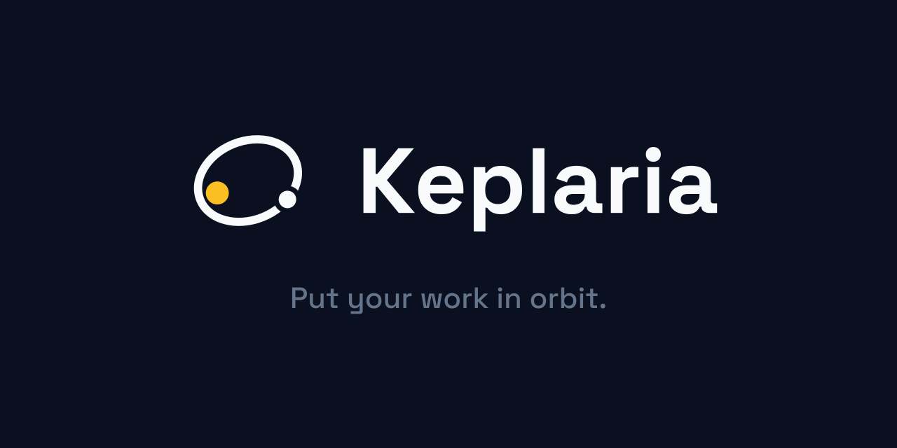
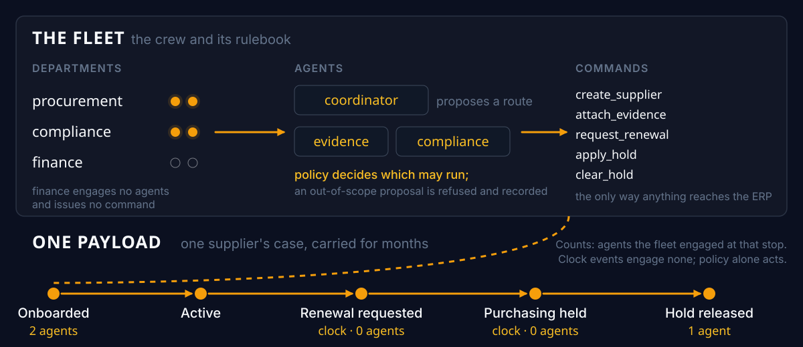

<p align="center">
  
</p>

# Keplaria

**Supplier compliance is not a one-time check.** Certificates expire months
after onboarding, and someone has to notice, chase the renewal, and decide
whether it is still safe to buy. Every onboarding tool retires the day the
ERP record is created, and the ongoing work goes back to a person with a
calendar reminder.

**Keplaria stays.** One durable mission per supplier: it onboards the supplier
into a real ERP (enterprise resource planning: the business's system of record
for suppliers and purchasing), then wakes months later on its own clock,
requests renewed evidence, places a reversible purchasing hold when the
certificate lapses, validates the renewal against the source document, and
releases the hold. It stops exactly where policy requires a human decision —
and nowhere else.

One deployed run of that whole lifecycle: **45.1 s of machine time** and a
single **22.4 s human approval**, against the same work done by hand in
**663.5 s over 20 steps**, **19 of which the run removes**; the twentieth
is the approval that policy requires a human to make (author-timed, not
practitioner-reviewed; method and every qualifier in
[the proof section](#judging-criteria--proof)).

Built on the [Google Agent Development Kit (ADK)](https://adk.dev) for
Python, running on the
[Gemini Enterprise Agent Platform](https://docs.cloud.google.com/gemini-enterprise-agent-platform/models/start).

## Evaluate this in three minutes

1. **Open the [case console](https://keplaria-console-bklu5jcdea-uc.a.run.app)**
   (no sign-in). **The fleet is the crew and its rulebook:** three
   departments, a coordinator that proposes, two specialist agents, and the
   five ERP commands they may issue. **A payload is one supplier's case**,
   carried through that fleet for months. The console lists payloads
   grouped by supplier; the [fleet page](https://keplaria-console-bklu5jcdea-uc.a.run.app/fleet)
   is the rulebook, with a count of how many cases exercised each rule.
   Open a case: the strip at the top shows where it sits in the lifecycle
   (onboarded → active → renewal requested → held → released), and the
   status line says what has actually been written to the ERP; for a
   parked case, nothing yet.
2. **Open [Ground Control](https://keplaria-review-bklu5jcdea-uc.a.run.app/review)**,
   the human decision surface. Sign-in is Google, through Cloud IAP
   (Identity-Aware Proxy: Google's sign-in gate in front of the service);
   the two
   organizer accounts are pre-authorized ([details below](#access-for-judges-and-testers)).
   Cases the policy stopped wait here with their ERP writes held; an
   approval is what releases them.
3. **Watch the demonstration video** (not linked yet: it publishes with
   the Devpost submission and will be linked here then). What it shows: one
   continuous unedited take. A stop for a human, an approval releasing
   the ERP writes the same moment, then a simulated year and a half of
   renewals, a hold, and a release.

What those three show together: the model proposes, deterministic policy
decides, a human stays in exactly the loop policy requires, and nothing
reaches the ERP except through a policy-gated command from the outbox,
safe to retry: a retried command leaves exactly one ERP record. The one
at-least-once channel is outbound mail, which can repeat a message but
never a record.



## Access for judges and testers

Nothing in this repository needs a credential to evaluate. The evidence files
are committed, `bash scripts/doctor.sh` is read-only and prints its own
pass/fail summary, and the case console below opens in a logged-out browser.
Two hosted surfaces exist, and only one of them asks who you are.

| Surface | Sign-in | What it is |
|---|---|---|
| [Case console](https://keplaria-console-bklu5jcdea-uc.a.run.app) | None | Read-only. Renders a case as it was scored and its current band (the policy verdict: clear, review, or blocked). The service account behind it holds a Firestore *viewer* role, so read-only is an IAM fact rather than a promise about the route table. |
| [Review console (Ground Control)](https://keplaria-review-bklu5jcdea-uc.a.run.app/review) | Google, through Cloud IAP | Lists cases parked for a human and commits the decision that releases the queued ERP write. |

**Signing in to the review console.** Cloud IAP admits the two addresses the
organizers gave repository access (`testing@devpost.com` and
`cloudhackathons@google.com`) plus the author. Open the link in a browser
signed in to one of those Google accounts; there is no password to request and
no separate account to create. Two behaviours are the system working, not
failing:

- **An anonymous request is redirected to `accounts.google.com`.** IAP bounces
  a browser to sign-in rather than answering 401, so a redirect is the refusal.
  `curl` sees the same 302.
- **A signed-in account outside those three gets 403 from IAP.** The reviewer's
  identity is read from a signed IAP assertion, never from a forwarded header,
  so there is no way to assert an identity into this service from outside.

**A decision is final for the case version it was taken against.** The approval
id is derived from the case and its version, so a double click or a resubmitted
form is refused as a duplicate rather than applied twice. If a later event
advances the case, an earlier decision stops applying and the case comes back
for a fresh look.

If sign-in fails for an address listed above, that is a misconfiguration on our
side rather than an intended refusal; please note it in the submission
feedback. `bash scripts/doctor.sh` reports the same grant from the outside and
will say so plainly. (Availability and running cost are measured separately;
[details near the end of this file](#availability-and-cost).)

## Judging criteria → proof

These three rows are the Devpost hackathon's Fortified Enterprise Fleet track
rubric, with its published 40/30/30 weighting. This table matches each judging
criterion to what it asks and where the proof for it lives in this repository.
Every row points at a file that was produced by running the system, not by
describing it. Proof directories live under `spikes/`; each spike is a
self-contained proof: the harness that was run and the `evidence.json` it
wrote. `spikes/core_contracts/harness.py` re-executes the tests it
cites and re-reads the evidence it cites on every run, so a claim here cannot
outlive the behaviour behind it.

| Criterion | What it asks | Proof in this repo |
|---|---|---|
| **Innovation & Operational Utility** (40%) | Does it remove real friction, decide autonomously, and complete high-value work rather than chat? Is the task complex enough to warrant multiple agents, and does it delegate intelligently? Was it built for an "Unlikely Hero" outside of standard corporate roles? | The lifecycle closes: onboarded → active → renewal requested → held → released, over two suppliers and 380 simulated business days (about a year and a half), in [`spikes/judge_run/`](spikes/judge_run/). A coordinator (the routing agent) selects the Evidence and/or Compliance agent from the event and the case's own state; two case variants take different routes. Friction is measured against the manual baseline above, not asserted. The overlooked party is the supplier side of the relationship (often a small business with no compliance department), and the system deliberately asks nothing of them: no portal, no login, no account, no training. The renewal request is a real outbound email; in this prototype the returned certificate enters as a published event, and ingesting the email reply itself is design intent, stated as such wherever the claim appears. |
| **Architectural Discipline & Tech Stack** (30%) | Are systems decoupled and maintainable, state durable, tools isolated, credentials scoped, failures handled? (The security boundary is summarised in [Security model, in six claims](#security-model-in-six-claims).) How does routing recover from a looping or hallucinating worker? | Nine contracts in [`spikes/core_contracts/evidence.json`](spikes/core_contracts/evidence.json): closed loop, duplicate and out-of-order events, provenance failure (an extracted value with no supporting source span), injection refusal, stale and double approval, forbidden agent→tool edges, one ERP write after a retry, cataloging visible, and the eval suite (24/24 graded domain cases passing). A schema-valid but source-unsupported worker (specialist agent) value is rejected, retried within bounds, and quarantined for a human instead of reaching the ERP. |
| **Demo & Production Readiness** (30%) | Does the video define the friction and architecture, show an unedited live execution, and are setup, diagram, deployment and proof reproducible? | The console URL above is live. The run in `spikes/judge_run/` is a real deployment, re-run on the engine currently serving. `bash scripts/doctor.sh` checks deployment and configuration preconditions read-only and prints its own pass/fail summary; the architecture diagram is generated from committed sources, not drawn; setup is [below](#setup-from-a-fresh-clone). |

## Security model, in six claims

Each claim below is proven somewhere else in this repository; this list exists
so a reader who watched the video can find the proof without reading five
sections. Nothing here is a second copy: follow the link.

1. **No agent holds a credential or a write tool.** The evidence and
   compliance agents carry no operational tools, and a clock event never
   reaches an LLM agent (`forbidden_agent_tool_edges` in
   [`spikes/core_contracts/evidence.json`](spikes/core_contracts/evidence.json)).
2. **One executor, one scoped ERP identity, read back off the live site.** The
   deployed services run as `keplaria-executor`, a purpose-made ERP user with
   one role: it cannot delete, cannot widen its own permissions, and cannot
   reach a financial document. Measured every run, not described
   ([`spikes/frappe_scoped_executor/evidence.json`](spikes/frappe_scoped_executor/evidence.json);
   the two identities are explained under [ERPNext](#erpnext-frappe-cloud)).
3. **A tainted document never reaches an agent.** A deterministic scan runs
   before any agent reads the pages; a tainted page is withheld from
   agent-resolvable state and `DOCUMENT_INJECTION` forces the gate to blocked.
   The scan is a heuristic over the planted fixture, not a general defence,
   and the README says so under [Event flow](#event-flow) ("Document
   injection gate").
4. **The reviewer's identity is verified, not asserted.** The review console
   sits behind Cloud IAP and `console/iap.py` verifies the signed assertion
   against Google's certificates and the configured audience; a forwarded
   header is never trusted ([Identity is verified, not
   asserted](#identity-is-verified-not-asserted)).
5. **Secrets come from Secret Manager, per service identity, and the engine
   has no internet path.** The mission graph reaches the screening service
   over Private Service Connect only; anything that must call the public
   internet runs on Cloud Run ([Platform subsystem
   coverage](#platform-subsystem-coverage), "Agent Identity").
6. **Failure becomes durable state, never a silent exception.** A failed ERP
   command stays in the outbox with its attempt count; the unattended sweep
   re-drives it once the destination is repaired, and the retried write is
   singular (`one_erp_write_after_retry`, proven against a live command). A
   value with no supporting source span is rejected, retried within bounds,
   and parked for a human with zero ERP writes (`provenance_failure`).

Model Armor was measured against this corpus and not adopted; the numbers are
in the coverage table below.

## Platform subsystem coverage

Read this table by its Status column: it is an honest status report, not a
checklist to maximize, so "deliberately not used" counts as a complete answer.
The track names seven subsystems. This table says which are used natively, which
are answered by a first-party equivalent, and which are deliberately not used.
A subsystem that is not used says so and says why, including the one that was
measured and turned down.

| Subsystem | Status | What is actually true |
|---|---|---|
| **Agent Runtime** | Native | Hosts the ADK graph as reasoning engine `keplaria`. Reaches the screening VM over a Private Service Connect (PSC) interface; that VM has no external IP and is not reachable from the internet, and keeps execution state in Agent Platform Sessions. |
| **Agent Registry** | Native | The deployment auto-registers with no publish step; the entry is live and refreshes on redeploy. It carries the framework (`google-adk`), the runtime reference, the runtime identity principal, and the callable interfaces. Honest limit: those are the fields the Registry populates itself; it holds no owner, purpose, or tool-scope description of its own. |
| **Agent Identity** | First-party equivalent | Each service runs as its own service account; secrets come from Secret Manager. The ERP credential is confined rather than spread: only the deterministic executor at the ingress holds it, and no agent ever does. That credential is scoped to the work: it belongs to a purpose-made ERP user holding one role, which grants read, write and create on supplier records and create on correspondence and attachments, and nothing else. It cannot delete a record it created, cannot widen its own permissions, and cannot read an invoice, a payment or a ledger. Those limits are measured against the live site rather than described ([`spikes/frappe_scoped_executor/evidence.json`](spikes/frappe_scoped_executor/evidence.json)), including the reads the ERP grants any signed-in user, which the check records rather than leaves implied. The reviewer's identity is verified from a signed IAP assertion, never from a header a caller could set. |
| **Memory Bank** | Deliberately not used | Transactional Firestore owns authoritative case state (case version, event claim, approval, command outbox), and Sessions retain resumable agent history. Generative memory is not trusted with compliance facts, and Sessions are not described here as a Memory Bank equivalent; they hold different things. |
| **Model Armor** | Measured, not adopted | Probed against this project's own corpus on 2026-08-19 and turned down on the evidence: its prompt-injection filter returns `NO_MATCH_FOUND` on the planted injection fixture that the incumbent check catches with five findings, and its data plane is unreachable from the engine's network. One filter did deliver: malicious-URI detection, with no false positives on clean fixtures. Full measurement, including the context-dilution boundary that explains the miss: [`spikes/model_armor/evidence.json`](spikes/model_armor/evidence.json). |
| **Agent Gateway** | Not used | Ingress is an authenticated Pub/Sub push adapter on Cloud Run that refuses anonymous callers, and the human decision surface sits behind IAP. Nothing in the design needed a gateway in front of that. |
| **Agent Observability** | Native | Cloud Trace and Cloud Logging. Traces are load-bearing rather than decorative: a 10.6 s rise in run time was diagnosed node-by-node against them and traced to model reasoning length, not to code. |

### An open-weights model, measured and not adopted

A second Google model was evaluated for the extraction step and turned down on
the evidence, the same way Model Armor was above. The result is worth stating
precisely, because its two halves point opposite ways: **Gemma 4 read every
test document correctly, and would not return the format the extraction step
requires.**

Extraction here is not free text. The agent must return each value together
with the verbatim span of page text it came from, in a fixed structure a
deterministic validator checks before anything is believed. Served through
Vertex AI, Gemma 4 got the content right on all six test documents: company
names, identifiers, expiry dates and their supporting spans, including the
document that carries no expiry at all, where the correct answer is to return
none, and the one carrying a planted instruction beside a decoy far-future
date, where it took the real date. It returned the required structure on none
of them, in three different shapes across otherwise identical calls: the right
values under the wrong key names, the list of fields rewritten as an object,
and a response with no field list at all.

| Measured over six documents | Read the values correctly | Returned the required format | Median |
|---|---|---|---|
| `gemini-3.6-flash`, the model in use | 6 of 6 | 6 of 6 | 2.3 s |
| Gemma 4 26B, served by Vertex AI | 6 of 6 | 0 of 6 | 8.8 s |
| The same Gemma weights, run locally | 6 of 6 | 6 of 6 | 91.4 s |

The third row is the finding. Identical weights score full marks on both
columns when the local runtime constrains generation to the required
structure, and lose the format column entirely when served without that
constraint. What differs is how the model is served, not how it reads.

Not adopted, for two reasons. Every agent in this system returns a fixed
structure, so a model whose output shape varies between identical calls would
need a repair layer in production code existing only to correct it. And at
roughly nine seconds against the current step's two, it spends a budget the
whole run has to finish inside. The local column is a workstation result and
carries no deployment claim: at ninety seconds a document it could not serve
this system either. Full measurement, including every raw response and each
repair the comparison applied before grading:
[`spikes/gemma_extraction/evidence.json`](spikes/gemma_extraction/evidence.json).

## Architecture


The diagram is generated, not drawn: `uv run python docs/architecture/build.py`
rebuilds `docs/architecture/architecture.svg` from the committed sources under
`docs/architecture/assets/` (a PNG export for form uploads sits alongside it).
Update the build script whenever a component is added or moved: the diagram
is part of the submission and must match the deployed system.

A third generated figure, `docs/architecture/orientation.svg` from
`uv run python docs/architecture/build_orientation.py`, is the
fleet-and-payload orientation shown near the top of this file and on the
console; the same command refreshes the console's copy, and `doctor.sh`
byte-checks it like the other two.

### keplaria.com

The public front door and the verification ledger are two generated static
files served by Cloudflare Workers Assets (no Worker script: the page's whole
job is to be reachable, and a runtime is a failure mode it does not need).

```bash
uv run python site/build_site.py        # regenerate site/dist from the ledger
(cd site && wrangler deploy)            # publish to keplaria.com + www
```

`/proof` is generated from `docs/proof/claims.toml` and re-reads each evidence
file, so the published numbers cannot drift from the runs that produced them;
there is no hand-written second copy. `scripts/doctor.sh` byte-compares
`site/dist` against the generator and checks that the domain serves 200.

A second, deliberately reduced diagram exists for the submission video:
`docs/architecture/judge-diagram.svg`, from
`uv run python docs/architecture/build_judge_diagram.py`. It is six boxes on
the 1920×1080 video frame, with nothing meaningful below 28px; the dense
diagram above is a poster you lean into, and its 10–13px labels are unreadable
on screen. `scripts/doctor.sh` byte-compares both SVGs against their builds.
Neither PNG is byte-checked: the judge diagram's PNG is a browser render, so
re-export it whenever that check fires.

The agent graph and its adapters run on two different runtimes:

- **Agent Runtime** hosts the ADK graph as reasoning engine `keplaria`
  (`projects/584548214478/locations/us-central1/reasoningEngines/2127503872455868416`).
  It reaches yente (an open-source sanctions-screening service, running on
  a private VM) over the `keplaria-psc2` PSC-I network attachment and keeps
  agent execution state in Agent Platform
  Sessions.
- **Cloud Run** hosts `keplaria-ingress`, the authenticated Pub/Sub push
  adapter and the component that talks to both Firestore and the ERP, plus
  two more services covering the human side of a parked case:
  `keplaria-console` (public, read-only case visibility) and
  `keplaria-review` (the authenticated decision surface). See
  [Case console and review service](#case-console-and-review-service).
  `keplaria-ingress` is the only one of the three that can push a state
  change through the graph; the other two only read and decide on state the
  graph already produced.

Everything is in `us-central1`.

### Event flow

```text
topic keplaria-events
  -> OIDC-authenticated push subscription keplaria-events-push
  -> private Cloud Run ingress (keplaria-ingress)
  -> Firestore inbox transaction (claims event_id, creates/advances the
     case, bumps case_version)
  -> Agent Runtime graph: parse -> LLM (large language model) coordinator
     routing proposal ->
     deterministic route validation (app/policy.py, derived from
     catalog/fleet.v1.json) -> yente screening
     over PSC-I -> (when candidates exist) compliance interpretation,
     independently checked -> deterministic risk gate (app/risk.py) ->
     queue ERP command, or park/quarantine the case
  -> ingress drains the command outbox and performs the ERP write
```

**The ERP executor runs in the ingress, not in the graph.** The
PSC-attached engine has no public internet egress (Cloud NAT is
`ENDPOINT_TYPE_VM`, which does not cover a PSC interface NIC), so the engine
itself cannot reach Frappe Cloud. The deterministic executor that performs
ERP writes therefore lives in the ingress process. This is a genuinely
separate component from the agent graph, by design, not a workaround.

The next few paragraphs establish two independent checks that separate what
the model suggests from what actually reaches the ERP, plus one rule that
holds can never be blocked by approval requirements.

**Two deterministic gates, both fail-closed.** The LLM coordinator only
proposes a route; `app/policy.py` decides whether it is permitted, and a
refused proposal routes to a `quarantine_case` terminal that performs no
command claim and no ERP write.

Route validation is derived from a versioned catalog artifact
(`catalog/fleet.v1.json`), which also scopes three departments
(procurement, compliance, finance) over agents and commands. The
department on an event is a policy-and-audit label asserted by its
producer, not an authenticated identity: an event whose department
proposes an agent outside its scope is refused, quarantined, and durably
recorded (`DEPARTMENT_FORBIDS_AGENT`), and a command outside its scope is
refused at claim time with no outbox row. Finance's scope is empty: its
events engage no agents and cannot originate supplier writes; proposing
either is refused and recorded. Clock events stamp `procurement` by
convention (the scheduler acts on behalf of the supplier lifecycle
procurement owns; a modeling convention, not a claim of human origin). A
catalog that cannot load refuses every proposal; there is no fallback
map. The catalog ships in the container: scope changes take effect at the
next deployment, not live. The public console renders each department's
enforced scope at `/fleet` from the same artifact.

Screening results then pass through a second,
independent gate: `app/risk.py` scores the case against a versioned policy
fixture (`policy/supplier_risk.v2.json`) and returns one of three bands.
`clear` queues the ERP command; `review` parks the case as
`awaiting_approval`; `blocked` quarantines it. A supplier yente flags as a
match scores at or above the block threshold and never reaches the command
queue. `app/executor/runner.py`, run from the ingress, re-reads that
persisted verdict before draining any command and refuses to drain one whose
case is not `clear`, at a different identity boundary, since the Cloud Run
ingress runs under a different identity than the Agent Runtime graph.

For a `blocked` case that refusal is a backstop rather than a second
independent check: `quarantine_case` claims nothing, so there is nothing to
refuse, and the graph's `assess_risk` branch is what actually stops a flagged
supplier. For a `review` case it is the primary enforcement; see below.

**Human approval.** A parked case claims the commands it would run and
executes none of them, so a reviewer can see what they are approving rather
than only that something is waiting. Those commands drain to
`refused_by_policy` on every pass until a decision arrives.
`app/state/approvals.py` commits that decision in a single Firestore
transaction, keyed by an `approval_id` and taken against a specific
`case_version`. A replayed `approval_id` is rejected as a duplicate; a
decision taken against a version the case has since passed is rejected as
stale; and an approval stops applying the moment a later event advances the
case version, so it can never authorise a write for state the reviewer never
saw.

The deterministic gate's verdict is never overwritten. The executor combines
the machine's band with the human's decision and records both, so the outbox
shows whether policy or a person decided, and a rejection can withhold what
the gate would have granted.

Restrictive actions (a hold) bypass this entirely, and the consequence is
sharper than "bypass" suggests: **a hold never waits for a human at all.** The
executor refuses only permissive commands and the ingress drains the outbox
after every engine invocation, so a claimed `apply_hold` executes on that
drain while the case is still parking: it is already applied in the ERP
before a reviewer opens the page. Refusing to hold a risky supplier because a case is
under review would invert the gate's purpose, so the guard is deliberately
one-directional: it can stop this process granting something, never stop it
withholding something.

Both directions are proven on the deployed system, by a reviewer signed in
through IAP:

- **Approval releases** — `spikes/hitl_release/evidence.json` (HITL:
  human-in-the-loop). A case parked on a genuine near-match (0.672,
  `match=false`) was approved and `create_supplier` wrote to the live ERP.
- **Rejection withholds** — `spikes/hitl_reject/evidence.json`, track A.
  `create_supplier` stayed `pending` and no Supplier was ever created.
- **Rejection does not withhold a restriction** — same evidence, track B. The
  ERP hold was written 11m08s *before* the decision committed, both Firestore
  server timestamps, while the three permissive commands beside it stayed
  refused after the rejection.

Track B also shows that a parked case still advances: its lifecycle walked
`active → renewal_requested → held` with every permissive command refused
throughout, because `park_case` persists lifecycle state and only *execution*
is gated.

Honest limits. The `review` band is a parked case, not a live pause:
`RequestInput` is not in this graph, and a later milestone reinstates a real
pause on this same branch. `apply_hold` is the only member of
`app.lifecycle.RESTRICTIVE`, so the restrictive claim is about one action, not
a category. And a `blocked` case claims nothing at all, so a supplier who
becomes sanctioned after onboarding still cannot be held; closing that means
letting the quarantine terminal claim restrictive commands, which is a
separate decision.

**Document injection gate.** `app/injection.py` scans a document's redacted
text for a sentence that pairs a machine-directed instruction (imperative
phrasing aimed at the reader-as-agent) with a machine-reader signal, before
any agent sees that text. This is a **heuristic over a representative
fixture, not a general prompt-injection defence**: it does not claim to
catch every phrasing of an injected instruction, only the pattern the fixture
exercises. What it does guarantee is exact: `load_case_state` marks a
document carrying that pattern `document_tainted` and blanks its text out of
the state keys an agent instruction can resolve, so a tainted document is
never shown to a model. `apply_route` still routes the case to screening
when the event type permits compliance (the entity gets checked in that
case) but skips extraction entirely, so no agent ever reads the tainted
text or acts on an instruction inside it.
`DOCUMENT_INJECTION` is a scored factor in the risk policy and the gate in
`app/nodes.py`'s `assess_risk` additionally forces the verdict to `blocked`
on both the fresh-scoring and carry-forward paths whenever the flag is set,
regardless of what the rest of the score says. The combination — no
agent-visible text, no extraction, and a gate that cannot clear a tainted
event — means **a tainted document cannot produce an ERP write**.

Grounding is a separate control and is **not** what stops this: `app/grounding.py`
checks that an extracted field's span traces back to the source document, and
by design it will accept an extraction that faithfully quotes an injected
instruction: grounding certifies faithfulness to the text, not the
trustworthiness of the text's author. `tests/unit/test_grounding.py::test_grounding_accepts_an_injection_obedient_extraction`
pins exactly this as a regression, not an endorsement: the control that stops
an injected value from reaching the ERP is the injection gate described
above, not grounding.

**Idempotency.** Every side effect is a Firestore command with a
deterministic ID (`{case_id}:{action}`). A command already `DONE` is never
re-driven, so a replayed event produces exactly one ERP write. ERP records
are keyed by supplier name, the same deterministic external id the outbox
reconciles against, so a duplicate create collides natively (409)
and is reported rather than retried blindly. The one side effect without
destination-level reconciliation is outbound renewal mail: the ERP does not
deduplicate outbound messages, so an accepted send whose response is lost
before the command records `DONE` can repeat a message on the next drain:
a repeated message, never a repeated record. The claim here is scoped
accordingly: record writes are idempotent; message sends are at-least-once.

### Verification

*The first two entries below prove the headline claims; the rest is
reference for re-running any one specific proof.*

- `scripts/doctor.sh` — a read-only check suite that prints its own pass/fail
  summary (one check fewer when the yente VM is stopped, since the serving
  probe only runs against a running VM) covering toolchain, auth,
  provisioned infra, the event-flow wiring (topic, push subscription
  OIDC, ingress auth, concurrency/maxScale, retry policy), the console and
  review services, and the failure-handling infrastructure (dead-letter
  topic, `maxDeliveryAttempts`, both Pub/Sub service-agent bindings, the
  sweep schedule, and the `outbox` collection-group index in both Firestore
  databases); see
  [Case console and review service](#case-console-and-review-service) and
  [Failure handling](docs/operations.md#failure-handling).
- `spikes/core_contracts/harness.py` — the one artifact that answers "is
  everything this system claims still proven?". It does not re-run the closed
  loop; it re-executes the pytest node ids and re-reads the spike evidence
  that back each contract (duplicate and out-of-order events, provenance
  failure, injection refusal, stale and double approval, forbidden
  agent→tool edges, one ERP write after retry, cataloging, the graded eval
  suite), plus two read-only live checks: one against deployed Firestore and
  the ERP, one against Agent Registry. **Deliberately self-checking rather
  than a hand-maintained list:** a test that is deleted, renamed, or red
  demotes its criterion instead of continuing to look green. Exits non-zero if
  any contract is unproven, and writes
  `spikes/core_contracts/evidence.json`. Needs `--env-file .env` for the live
  checks.

  Both live checks **discover** what they verify rather than naming it. The
  retry check asks the deployed ledger whether any command carries
  `status: done` with `execution_attempts >= 1` (`record_failure` is that
  field's only writer, so that combination *is* a failure followed by a
  success); the cataloging check queries Agent Registry for an entry naming a
  reasoning engine, carrying the expected display name, and pointing at the
  engine the runtime spike recorded. Neither is a hardcoded id, because both
  were: a routine ERP cleanup deleted the records the retry check named and
  took the criterion with them, and the cataloging claim rested on a note in
  the manifest rather than on anything a re-read could check.
- `scripts/claim_ledger.py` — the other direction: `core_contracts` asks
  whether the proofs still hold, this asks whether the **prose still matches
  them**. Every public number is listed in `docs/proof/claims.toml` with the
  evidence file and field that produces it; `--check` re-reads each one and
  renders it the way the prose states it, so a number that has drifted is
  reported as a mismatch rather than read past. `--render` regenerates
  [`docs/proof/claims.md`](docs/proof/claims.md) from the same data, which is
  why that page is generated and not written by hand. Claims no machine check
  can settle (a rounded comparison, a historical statement) are marked
  manual **with the reason stated**, because a false green is worse than an
  admitted gap. A number whose copy is not written yet is reported as pending,
  so the ledger doubles as the checklist for writing it. `doctor.sh` runs the
  check, and treats "the check could not run" as a warning rather than as a
  failed claim.
- `spikes/core_contracts/redrill_retry.py` — re-makes the retry proof when
  the ledger holds none. Some criteria assert things about *deployed state*,
  so their evidence is a pair of live records rather than a committed file,
  and live records get deleted. The failure it produces is real (a
  `clear_hold` against a supplier absent from the ERP, refused with a 404),
  the repair is real, and the **deployed sweep**, not the script, finds the
  failed command and drives it to `done`. Aborts if the supplier already
  exists, since the first drain would then succeed and leave
  `execution_attempts` at 0 while every step reported green. Writes
  `spikes/core_contracts/retry_drill.json`; `scripts/erp.py purge` refuses to
  delete anything that file names.
- `spikes/dlq/harness.py` — proves bounded retry and durable dead-lettering
  against deployed resources: a command driven to `dead` through five real
  ERP refusals and not re-driven a sixth time, the deployed `POST /admin/sweep`
  finding and driving a stuck case, and an event actually landing in
  `dead_events`. Writes `spikes/dlq/evidence.json`.
- `spikes/lifecycle/harness.py` — drives the full five-step station-keeping
  lifecycle (onboarding, early renewal check, renewal request, overdue hold,
  renewed evidence and hold release) against the deployed engine and ingress,
  and writes `spikes/lifecycle/evidence.json`. This is the current
  post-deploy verification script; see
  [Deploying](docs/operations.md#deploying-to-agent-runtime). The committed evidence is one
  five-step deployed lifecycle run with all five steps passing.
- `spikes/hitl_reject/harness.py` — the rejection half of the approval
  contract, in three modes (`park`, `verify`, `teardown`) because the decision
  itself is a human in a browser and cannot be automated. Parks two review-band
  cases: one whose supplier is absent from the ERP, so "the rejection created
  nothing" is checkable, and one walked through to an overdue hold. Asserts
  that the hold's completion timestamp *precedes* the approval's, which is what
  makes "a restriction never waits for a human" a measurement rather than a
  reading of the code. `teardown` releases the ERP hold and is deliberately
  separate, so the evidence is captured against a genuinely held record.
  Writes `spikes/hitl_reject/evidence.json`.
- `spikes/hitl_release/harness.py` — the approval half, same two-phase shape.
  Writes `spikes/hitl_release/evidence.json`.
- `spikes/run_streak/harness.py` — runs the judge rehearsal back to back,
  unattended, and grades the streak: ten consecutive runs under the 130s
  budget, two of them cold starts. `--runs/--cold/--idle-minutes` are
  arguments, so the real attempt is one command. Three things it does
  deliberately. It drives the approval **in process**, through the same
  `commit_approval` + `execute_pending_commands` pair the review route calls
  once IAP has admitted a reviewer, because that route is reachable only
  behind an assertion IAP injects server-side and ten browser approvals would
  make a failure at run nine cost the hour twice; the evidence file names the
  four things that leaves unexercised, in a required field, and the browser
  path stays proven by `spikes/hitl_release`. It treats a run as cold only
  when `keplaria-ingress` is **observed** at zero instances, never because an
  idle gap was waited out, and an unreadable metric counts as not cold. And a
  broken streak zeroes the cold count as well as the run count, since a cold
  start observed before a failure was observed on a streak that no longer
  exists. Evidence is rewritten after every run rather than at the end, so a
  crash at run nine still leaves nine measured runs on disk. Writes
  `spikes/run_streak/evidence.json`.
- `spikes/approval_contention/probe.py` — measures what concurrent approvals
  of the same case actually do, against the `keplaria-test` database. It
  exists because the unit tests drive the retry through a fake transaction
  factory, which pins the contract but cannot tell you what real Firestore
  hands the caller. What it found: `google-cloud-firestore`'s
  `@transactional` retries an `Aborted` raised by `transaction._commit()` and
  **only** that, so an `Aborted` raised by the reads inside the transaction
  escaped on the first attempt (9 of 48 contended calls, out of
  `batch_get_documents`). Exactly one commit won every round throughout, so
  nothing was ever double-approved; the damage was that a reviewer
  double-clicking Approve could get a 500 where the code means to answer
  "already decided". 0 of 48 since. Re-run it after any change to
  `app/state/approvals.py`.
- `spikes/thin_vertical/verify.py` — the narrower single-event vertical
  (event → route → screen → ERP write), superseded by the lifecycle harness
  as the post-deploy check but still runnable.

## Setup from a fresh clone

Requires [uv](https://docs.astral.sh/uv/) and the `gcloud` CLI. uv provisions its
own Python; no system interpreter, pyenv, or Homebrew Python is involved.

```bash
uv sync                                       # creates .venv from uv.lock
gcloud auth application-default login         # once per machine
cp .env.example .env                          # then edit if needed
uv run adk web                                # ADK dev UI
```

Operational runbooks (deploys, provisioning, failure handling, tooling)
live in [docs/operations.md](docs/operations.md).

## Environment

| | |
|---|---|
| Python | **3.13.13**, uv-managed (pinned in `.python-version`) |
| Package manager | **uv** |
| Venv | `.venv/` — self-contained, links to no system interpreter |
| ADK | `google-adk` 2.5.0 |
| Reference dev host | NVIDIA DGX Spark — Ubuntu 24.04, **aarch64** |
| Domain | **keplaria.com** — registered via Cloudflare Registrar (2026-08-11) |
| Cloudflare CLI | `wrangler` (nvm-managed Node), OAuth-authenticated |

The keplaria.com zone is live on Cloudflare nameservers, and the domain now
serves the generated site described [above](#keplariacom);
`scripts/doctor.sh` pings it as part of its checks. `wrangler` is logged in
as the personal account (the same identity as gcloud and git in this repo), with
write scopes for Workers, Pages, DNS routes, D1, KV, queues, email routing, and
SSL certs, so it can deploy and wire up DNS without re-authenticating. Brand
assets for the site live in the sibling repo `~/dev/git/keplaria-assets`.

## Google Cloud

| | |
|---|---|
| Project ID | `keplaria` (project number `584548214478`) |
| Region | `us-central1` |
| APIs enabled | Agent Platform (`aiplatform`), **Agent Registry (`agentregistry`)**, **Cloud Resource Manager**, Run, Compute, Firestore, Pub/Sub, Secret Manager, Cloud Scheduler, BigQuery, Cloud Trace, IAP, Model Armor, Cloud Build, Artifact Registry, Cloud Functions, Eventarc, Cloud Billing (+Budgets) |

`cloudresourcemanager.googleapis.com` is not optional: the GCP OpenTelemetry
resource detector and the Cloud Logging client both call it, and it was disabled
until 2026-08-13.

Authentication is via Application Default Credentials. Verify with:

```bash
gcloud config list                                  # expect project = keplaria
gcloud auth application-default print-access-token  # expect a token
```

`aiplatform.googleapis.com` is now surfaced as the **Agent Platform API**: the
Vertex AI API under its current name, not a separate product.

## Configuration

Credentials and platform selection go in a `.env` at the project root. `.env` is
gitignored; never commit keys.

```dotenv
GOOGLE_GENAI_USE_ENTERPRISE=true
GOOGLE_CLOUD_PROJECT=keplaria
GOOGLE_CLOUD_LOCATION=global
```

`GOOGLE_GENAI_USE_ENTERPRISE` routes the SDK to Gemini Enterprise Agent Platform
endpoints. `GOOGLE_GENAI_USE_VERTEXAI` is the **legacy alias** for the same
flag; prefer the former in new code. Setting both to conflicting values raises
`ValueError`. With ADC configured, no `GOOGLE_API_KEY` is needed; that variable
is for the Gemini Developer API instead.

**Region is `us-central1`**, the full GCP region name (there is no bare
`central1`; regions always carry the geography prefix). Use it consistently for
`agents-cli deploy --region` and any infrastructure. **The one exception is
`GOOGLE_CLOUD_LOCATION`, which stays `global`**: it selects the model-serving
endpoint, not a resource region, and `gemini-3.6-flash` 404s at `us-central1`
(see docs/operations.md "Operational constraints";
`AGENT_ENGINE_LOCATION=us-central1` is the separate variable for the Agent
Engine endpoint). `GOOGLE_CLOUD_LOCATION` has no SDK default, so it must be
set explicitly rather than relied upon.

## Case console and review service

Two Cloud Run services, built from one image (`console/Dockerfile`, entry
points `console.public:api` and `console.review:api`), cover the human side
of a parked case: seeing it, and deciding on it.

- **`keplaria-console`** — public, unauthenticated, read-only. Renders
  `console/projection.py`'s allowlist view of a case: what it looked like
  when it was scored, and its current effective band. The routing panel
  shows the coordinator's **proposal** beside the route policy actually
  **engaged**, plus both directions of the policy diff: agents `dropped`
  and agents `added` to complete an under-proposal. Rendering only the
  engaged route would show the outcome and hide the decision, which reads
  as though the gate can subtract but never add. `console/store.py` is
  explicit that "no route here calls a write" is a claim about the route
  table, not about what got imported: `console/projection.py` needs
  `effective_band` from `app.executor.runner`, and that module's import
  graph reaches the ERP write path. Nothing in this app's routes calls it,
  but the actual enforcement boundary is the IAM role this service runs
  under. That is why its deploy grants `roles/datastore.viewer`, not
  `roles/datastore.user`: the read-only property is an IAM fact, not a code
  fact.
- **`keplaria-review`** — authenticated, behind Cloud IAP. Lists parked
  cases and commits a decision through the same `commit_approval` /
  `execute_pending_commands` composition `tests/unit/test_approval_release.py`
  pins, then drains. It writes the decision and the resulting command state,
  so it needs `roles/datastore.user`, and because a committed approval can
  execute a queued ERP write, it also holds Frappe Cloud credentials, as a
  second Cloud Run identity alongside `keplaria-ingress` (see "First-time
  provisioning" below; both service accounts exist and `scripts/doctor.sh`
  checks them).

### Identity is verified, not asserted

`console/iap.py` never trusts the plaintext email header the proxy forwards;
it verifies the signed `X-Goog-IAP-JWT-Assertion` against Google's published
IAP certs and against `IAP_AUDIENCE`, an environment variable this
deployment must be told explicitly (lookup command in `.env.example`). Two
failure modes, both closed, and meant to read differently to whoever is
debugging a stuck approval:

- **`IAP_AUDIENCE` unset → every request gets 503.** The service cannot
  state who it is, so it cannot check that a token was addressed to it, and
  refuses everything rather than accept a token minted for something else.
  This is the single most likely first-deploy mistake: a `keplaria-review`
  revision that comes up healthy and then 503s on every reviewer.
- **Any assertion that fails verification → 403.** Missing header, bad
  signature, expired token, wrong audience: all the same answer, all
  closed.

### Decisions are final per case version

`console/review.py` derives `approval_id` as
`{case_id}:v{expected_case_version}` rather than generating one: a double
click, a browser retry, and a resubmitted form all produce the identical id,
so the second attempt is refused as a duplicate with no client-side
idempotency token to plumb through anywhere. The consequence, accepted
deliberately: a decision is final for the case version it was taken
against. If the case advances again (a later event bumps `case_version`),
the approval stops applying and the case needs a fresh look, but the
original decision itself cannot be redone.

### Honest limit: durable state, not a live pause

**This is a durable-state approval surface, not a live pause.** The graph
does not suspend mid-run waiting on input (there is no such node in this
graph); it parks the case (`awaiting_approval`) and returns. Approval acts
on the Firestore state afterwards: a reviewer reads what was persisted, the
review service commits a decision against that same state, and the next
event pass (or a manual drain) is what actually executes on it. No case is
ever sitting mid-run waiting on this UI.

## ERPNext (Frappe Cloud)

- Site: **`andina-foods.v.frappe.cloud`** on the $10 shared plan. The site was
  renamed after creation, so **dashboard URLs use the immutable internal name
  `erpnext-ojg-vfe.v.frappe.cloud`** (old host 308-redirects; note HTTP clients
  drop `Authorization` on cross-host redirects).
- Company: **Andina Foods** — currency USD, country Colombia, abbreviation
  `AF`, no demo data.
- API credentials: **two identities that are not interchangeable.** The
  deployed services hold the scoped executor, `keplaria-executor`, whose one
  role grants read/write/create on `Supplier`, read on `Supplier Group`, and
  read/create on `Communication` and `File`. It reaches them from Secret
  Manager as `frappe-api-key` / `frappe-api-secret`, and locally from
  `.env.secrets` as `FRAPPE_API_KEY` / `FRAPPE_API_SECRET`. The site owner's
  key is `FRAPPE_ADMIN_API_KEY` / `FRAPPE_ADMIN_API_SECRET` in `.env.secrets`
  alone, used by `scripts/erp.py` and by nothing else, because purging a
  record needs rights the executor deliberately lacks. Rotated on 2026-08-23;
  before that both were the owner's key. Re-provision the identity with
  `spikes/frappe_scoped_executor/provision.py` and re-measure it with the
  harness beside it.
- **Known issue:** the site's cron scheduler has never ticked (Frappe Cloud
  support ticket filed 2026-08-12), so Email Queue does not auto-flush.
  Outbound email works via API dispatch instead: queue with
  `communication.email.make`, then `email_queue.send_now`, proven in
  `spikes/frappe_capability/`. Probe for the fix: Email Queue `f7pj5o8901`
  flushing on its own + fresh `Scheduled Job Log` entries.

## Availability and cost

**These surfaces stay up, and the screening behind them does too.** The
sanctions-screening service runs on a private VM that used to stop every night
and wait for a human to start it, which is a poor thing to hand a reviewer who
opens the link on a Sunday. It now carries an hourly start schedule and no stop
schedule, so it comes back on its own within the hour whatever knocks it over.

We know what that costs because we measured it rather than pricing it from a
rate card. Gross running cost for the entire project is **$16.63** month to
date, before any credit is applied, read from a billing budget that
deliberately excludes credits, because every budget that includes them reports
`$0.00` while a credit is covering the bill, which is true and tells you
nothing. Per-SKU attribution from the billing export puts the screening VM at
$0.134 per hour it runs and roughly $0.72 a day for everything that bills
whether or not anything is running. The one number that had never been checked
against a bill, the cost of keeping the agent runtime warm, turned out to be
zero: that platform meters request-processing time, not held instances, so the
warm pin is free. Details in
[`spikes/cost_posture/`](spikes/cost_posture/evidence.json).
